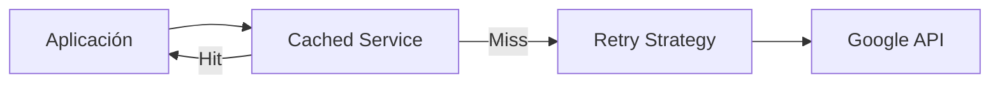

# Infrastructure Services Layer

## 🎯 Propósito y Rol en la Arquitectura

Esta carpeta (`infrastructure/services`) contiene la **implementación técnica** de los servicios definidos abstractamente en el Dominio.

En **Clean Architecture**, el Dominio define el _qué_ ("necesito un embedding", "necesito una respuesta de LLM"), y esta capa define el _cómo_ ("usando la API de Google Gemini", "reintentando si falla", "guardando en caché").

Estos servicios actúan como **Adapters** (Adaptadores), traduciendo las peticiones de tu aplicación al lenguaje de las APIs externas (Google GenAI, etc.).

---

## 🧩 Componentes Principales

### 1. Servicios de Embeddings (Text $\to$ Vector)

Convierten texto en vectores numéricos para búsqueda semántica.

| Archivo                       | Rol             | Descripción                                                                                                          |
| :---------------------------- | :-------------- | :------------------------------------------------------------------------------------------------------------------- |
| `google_embedding_service.py` | **Adapter**     | Habla directamente con `text-embedding-004` de Google. Maneja _batching_ (lotes de 10) para respetar límites de API. |
| `cached_embedding_service.py` | **Decorator**   | Envuelve al servicio real. Antes de llamar a Google, mira si ya tiene el vector calculado. Ahorra dinero y latencia. |
| `fake_embedding_service.py`   | **Test Double** | Genera vectores deterministas (hashing) sin llamar a internet. Vital para tests rápidos y CI/CD.                     |

**Flujo de Trabajo (Stacking):**



### 2. Servicios de LLM (Text context $\to$ Answer)

Generan respuestas en lenguaje natural usando modelos de IA generativa.

| Archivo                     | Rol             | Descripción                                                                                                     |
| :-------------------------- | :-------------- | :-------------------------------------------------------------------------------------------------------------- |
| `llm/google_llm_service.py` | **Adapter**     | Conecta con `gemini-1.5-flash`. Maneja prompts, RAG (Retrieval Augmented Generation) y Streaming de respuestas. |
| `llm/fake_llm.py`           | **Test Double** | Simula respuestas de IA de forma determinista para probar flujos sin gastar tokens.                             |

### 3. Resiliencia y Utilidades

| Archivo       | Rol                | Descripción                                                                                                                                  |
| :------------ | :----------------- | :------------------------------------------------------------------------------------------------------------------------------------------- |
| `retry.py`    | **Policy/Utility** | Define _cuándo_ y _cómo_ reintentar. Diferencia errores transitorios (reintentar) de permanentes (fallar rápido). Usa _Exponential Backoff_. |
| `__init__.py` | **Facade**         | Expone limpiamente los servicios al resto de la app, ocultando la estructura interna de carpetas.                                            |

---

## 🛠️ Patrones de Diseño Implementados

### Adapter Pattern

Todas las clases aquí implementan interfaces del dominio (`EmbeddingService`, `LLMService`). Esto permite cambiar Google por OpenAI mañana sin tocar una sola línea de la lógica de negocio.

### Decorator Pattern (`cached_embedding_service.py`)

Añade comportamiento (caching) dinámicamente sin modificar el servicio base. La aplicación no sabe si está hablando con el servicio con caché o el directo; la interfaz es idéntica.

### Retry Pattern (`retry.py`)

Envuelve llamadas inestables (red) con una política de reintentos inteligente.

- **Exponential Backoff:** Espera 1s, luego 2s, luego 4s... para no saturar al servidor caído.
- **Jitter:** Añade aleatoriedad para evitar "thundering herd" (que todos reintenten al mismo tiempo exacto).

### Deterministic Test Doubles (`fake_*.py`)

En lugar de usar mocks aleatorios, usamos implementaciones falsas pero **deterministas**.

- `hash("Hola")` siempre dará el mismo vector `[0.123, ...]`.
- Esto elimina los "Flaky Tests" (pruebas que fallan a veces sí, a veces no).

---

## 🚀 Guía de Uso Rápido

### Inyección de Dependencias

Normalmente no instancias estas clases directamente. El contenedor de dependencias (`apps/backend/app/container.py`) se encarga de ensamblarlas:

```python
# Ejemplo conceptual de ensamblaje
google_service = GoogleEmbeddingService(api_key="...")
caching_service = CachingEmbeddingService(provider=google_service, cache=redis_cache)

# La app recibe el caching_service, pero cree que es un EmbeddingService genérico
use_case = SearchUseCase(embedding_service=caching_service)
```

### Cuándo crear un nuevo servicio

- **Nuevo Proveedor:** Crea `openai_embedding_service.py` implementando `EmbeddingService`.
- **Nueva Lógica:** Si necesitas filtrar malas palabras, crea un `ModerationDecorator` que envuelva al servicio.
