# Architecture Overview

**Project:** RAG Corp  
**Last Updated:** 2025-12-30  
**Status:** In Active Development

---

## Table of Contents

1. [System Purpose](#system-purpose)
2. [High-Level Architecture](#high-level-architecture)
3. [Architecture Layers](#architecture-layers)
4. [Key Components](#key-components)
5. [Data Flow](#data-flow)
6. [Technology Stack](#technology-stack)
7. [Design Patterns](#design-patterns)
8. [Current vs Target State](#current-vs-target-state)

---

## System Purpose

RAG Corp is a **Retrieval-Augmented Generation (RAG)** system designed for corporate document search and Q&A. It enables users to:

- Ingest long-form documents (PDFs, text, Markdown)
- Perform semantic search over document corpus
- Generate contextual answers using LLM + retrieved documents
- Scale to millions of documents with sub-second latency

### Core Use Cases

1. **Document Ingestion:** Upload → Chunk → Embed → Store
2. **Semantic Search:** Query → Retrieve → Rank
3. **RAG Q&A:** Query → Retrieve → Generate → Answer

---

## High-Level Architecture

```mermaid
graph TB
    User[👤 User] --> Web[Next.js Web App]
    Web --> API[FastAPI Backend]
    API --> PG[(PostgreSQL + pgvector)]
    API --> Gemini[Google Gemini API]
    
    subgraph "Services"
        API
        PG
    end
    
    subgraph "External"
        Gemini
    end
    
    style User fill:#e1f5ff
    style Web fill:#bbdefb
    style API fill:#90caf9
    style PG fill:#64b5f6
    style Gemini fill:#42a5f5
```



### Components

| Component | Technology | Purpose |
|-----------|------------|---------|
| **Frontend** | Next.js 16.1.1 | User interface for document upload and Q&A |
| **Backend** | FastAPI | REST API for ingestion, search, and RAG |
| **Vector DB** | PostgreSQL 16 + pgvector | Store embeddings + metadata |
| **LLM** | Google Gemini Flash | Generate natural language answers |
| **Embeddings** | Gemini text-embedding-004 | Convert text to 768D vectors |

---

## Architecture Layers

RAG Corp follows **Clean Architecture** principles with three layers:

### 1. Domain Layer (`domain/`)

**Purpose:** Business logic and core entities  
**Dependencies:** None (framework-independent)

```
domain/
├── entities.py       # Document, Chunk, QueryResult
├── repositories.py   # DocumentRepository Protocol
└── services.py       # EmbeddingService, LLMService Protocols
```

**Key Concepts:**
- **Entities:** Pure Python dataclasses representing business objects
- **Protocols:** Abstract interfaces (Dependency Inversion)
- **No framework coupling:** Domain knows nothing about FastAPI or PostgreSQL

### 2. Application Layer (`application/`)

**Purpose:** Use cases and orchestration  
**Dependencies:** Domain layer only

```
application/
└── use_cases/
    ├── answer_query.py      # RAG Q&A use case
    ├── ingest_document.py   # (Planned) Document ingestion
    └── search_chunks.py     # (Planned) Semantic search
```

**Key Concepts:**
- **Use Cases:** Encapsulate business workflows
- **Input/Output DTOs:** `AnswerQueryInput`, `AnswerQueryOutput`
- **Orchestration:** Coordinate repositories and services

### 3. Infrastructure Layer (`infrastructure/`)

**Purpose:** Framework-specific implementations  
**Dependencies:** Domain layer (implements protocols)

```
infrastructure/
├── repositories/
│   └── postgres_document_repo.py   # DocumentRepository implementation
├── services/
│   ├── google_embedding_service.py # EmbeddingService implementation
│   └── google_llm_service.py       # LLMService implementation
└── text/
    └── chunker.py                  # Text chunking utility
```

**Key Concepts:**
- **Adapters:** Implement domain protocols
- **External Dependencies:** psycopg3, google-generativeai
- **Swappable:** Easy to replace (e.g., Gemini → OpenAI)

### 4. API Layer (`routes.py`, `main.py`)

**Purpose:** HTTP endpoint definitions  
**Dependencies:** Application layer (uses use cases)

```python
@router.post("/ask", response_model=AskRes)
def ask(
    req: QueryReq,
    use_case: AnswerQueryUseCase = Depends(get_answer_query_use_case)
) -> AskRes:
    # Framework layer only handles HTTP concerns
    result = use_case.execute(AnswerQueryInput(query=req.query, top_k=3))
    return AskRes(
        answer=result.answer,
        sources=[chunk.content for chunk in result.chunks]
    )
```

---

## Key Components

### Document Repository

**Purpose:** Persist and retrieve documents with embeddings

```python
class DocumentRepository(Protocol):
    def save_document(self, document: Document) -> None: ...
    def save_chunks(self, document_id: UUID, chunks: list[Chunk]) -> None: ...
    def find_similar_chunks(self, embedding: list[float], top_k: int) -> list[Chunk]: ...
```

**Implementation:** `PostgresDocumentRepository` (uses pgvector)

### Embedding Service

**Purpose:** Convert text to vector embeddings

```python
class EmbeddingService(Protocol):
    def embed_batch(self, texts: list[str]) -> list[list[float]]: ...
    def embed_query(self, query: str) -> list[float]: ...
```

**Implementation:** `GoogleEmbeddingService` (Gemini text-embedding-004)

### LLM Service

**Purpose:** Generate natural language from prompts

```python
class LLMService(Protocol):
    def generate_answer(self, query: str, context: str) -> str: ...
```

**Implementation:** `GoogleLLMService` (Gemini 1.5 Flash)

### Answer Query Use Case

**Purpose:** Orchestrate RAG workflow (retrieve + generate)

```python
class AnswerQueryUseCase:
    def execute(self, input: AnswerQueryInput) -> QueryResult:
        # 1. Embed query
        query_embedding = self.embedding_service.embed_query(input.query)
        
        # 2. Retrieve similar chunks
        chunks = self.repository.find_similar_chunks(
            embedding=query_embedding,
            top_k=5
        )
        
        # 3. Build context
        context = "\n\n".join(chunk.content for chunk in chunks)
        
        # 4. Generate answer
        answer = self.llm_service.generate_answer(input.query, context)
        
        return QueryResult(answer=answer, chunks=chunks)
```

---

## Data Flow

### Document Ingestion Flow


**Steps:**
1. User uploads document via API
2. Text chunker splits into 900-char chunks (120 overlap)
3. Embedding service converts each chunk to 768D vector
4. Repository persists chunks + embeddings to PostgreSQL
5. API returns document ID

### RAG Query Flow (via Clean Architecture)


**Steps:**
1. User sends query to `/v1/ask` endpoint
2. FastAPI delegates to `AnswerQueryUseCase`
3. Use case embeds query via `EmbeddingService.embed_query`
4. Use case retrieves top-5 similar chunks via `DocumentRepository`
5. Use case builds context from retrieved chunks
6. Use case generates answer via `LLMService.generate_answer`
7. Use case returns `QueryResult` to API layer
8. API converts to HTTP response

---

## Technology Stack

### Backend

| Layer | Technology | Version | Purpose |
|-------|------------|---------|---------|
| **Framework** | FastAPI | 0.115+ | REST API |
| **Database** | PostgreSQL | 16 | Relational + vector storage |
| **Vector Extension** | pgvector | 0.8.1 | Similarity search |
| **Embeddings** | Gemini text-embedding-004 | latest | Text → vectors |
| **LLM** | Gemini 1.5 Flash | latest | Text generation |
| **Runtime** | Python | 3.11 | Backend language |
| **Dependency Injection** | functools.lru_cache | stdlib | DI container |

### Frontend

| Component | Technology | Version | Purpose |
|-----------|------------|---------|---------|
| **Framework** | Next.js | 16.1.1 | React with App Router |
| **Language** | TypeScript | 5+ | Type safety |
| **Styling** | Tailwind CSS | 4 | Utility-first CSS |
| **API Client** | fetch | native | HTTP requests |

### DevOps

| Tool | Purpose |
|------|---------|
| **Docker Compose** | Local development orchestration |
| **pnpm** | Monorepo package manager |
| **Turborepo** | Build system and caching |

---

## Design Patterns

### 1. Repository Pattern

**Purpose:** Abstract data persistence

```python
# Domain layer defines interface
class DocumentRepository(Protocol):
    def save_document(self, document: Document) -> None: ...
    def save_chunks(self, document_id: UUID, chunks: list[Chunk]) -> None: ...
    def find_similar_chunks(self, embedding: list[float], top_k: int) -> list[Chunk]: ...

# Infrastructure layer implements
class PostgresDocumentRepository:
    def save_document(self, document: Document) -> None:
        # PostgreSQL-specific implementation
```

**Benefits:**
- Testable (easy to mock)
- Swappable (PostgreSQL → MongoDB)
- Domain logic independent of storage

### 2. Use Case Pattern

**Purpose:** Encapsulate business workflows

```python
class AnswerQueryUseCase:
    def __init__(
        self,
        repository: DocumentRepository,
        embedding_service: EmbeddingService,
        llm_service: LLMService
    ):
        self.repository = repository
        self.embedding_service = embedding_service
        self.llm_service = llm_service
    
    def execute(self, input: AnswerQueryInput) -> QueryResult:
        # Business logic here
```

**Benefits:**
- Single Responsibility Principle
- Easy to test in isolation
- Clear business intent

### 3. Strategy Pattern

**Purpose:** Swappable algorithms

```python
# Different LLM providers
class GoogleLLMService: ...
class OpenAILLMService: ...
class AnthropicLLMService: ...

# All implement the same interface
class LLMService(Protocol):
    def generate_answer(self, query: str, context: str) -> str: ...
```

**Benefits:**
- Easy A/B testing
- Vendor flexibility
- Runtime configuration

### 4. Dependency Injection

**Purpose:** Inversion of Control

```python
# container.py
@lru_cache
def get_document_repository() -> DocumentRepository:
    return PostgresDocumentRepository(...)

# routes.py (FastAPI Depends)
@router.post("/ask")
async def answer_query(
    use_case: AnswerQueryUseCase = Depends(get_answer_query_use_case)
):
    ...
```

**Benefits:**
- Loose coupling
- Easy testing (inject mocks)
- Centralized configuration

---

## Current vs Target State

### Current State (Phase 1 Complete)

✅ **Implemented:**
- Clean Architecture folder structure
- Domain entities (Document, Chunk, QueryResult)
- Repository and Service protocols
- PostgresDocumentRepository
- GoogleEmbeddingService, GoogleLLMService
- AnswerQueryUseCase (RAG workflow)
- Dependency injection container
- `/v1/ask` endpoint refactored to use Clean Architecture

❌ **Legacy Code (still exists):**
- `/ingest/text` endpoint uses old `Store` class
- `/query` endpoint uses old `Store` class
- Direct module imports (embeddings, llm, store)

### Target State (Phases 2-3)

🎯 **Planned:**
- Migrate `/ingest/text` to `IngestDocumentUseCase`
- Migrate `/query` to `SearchChunksUseCase`
- Add unit tests for all use cases
- Implement error handling strategy
- Add authentication and authorization
- Deploy to production with monitoring

### Migration Strategy

```
Phase 1 (✅ Complete): Domain + Infrastructure
│
├── Domain layer with protocols
├── Infrastructure implementations
├── AnswerQueryUseCase (star use case)
└── /v1/ask endpoint refactored

Phase 2 (🔄 In Progress):
│
├── IngestDocumentUseCase
├── SearchChunksUseCase
└── Remaining endpoint migrations

Phase 3 (📋 Planned):
│
├── Unit tests (80% coverage)
├── Integration tests
├── Error handling and logging
└── Production deployment
```

---

## Related Documentation

- **Architecture Decisions:**
  - [ADR-001: Google Gemini as LLM Provider](decisions/001-gemini-as-llm.md)
  - [ADR-002: Text Chunking Strategy](decisions/002-chunking-strategy.md)
  - [ADR-003: PostgreSQL + pgvector for Vector Storage](decisions/003-pgvector-storage.md)

- **Design Patterns:** [patterns.md](../design/patterns.md)
- **Clean Architecture:** [clean-architecture.md](../design/clean-architecture.md)
- **API Documentation:** [http-api.md](../api/http-api.md)
- **Database Schema:** [postgres-schema.md](../data/postgres-schema.md)
- **Diagrams:**
  - [Component Diagram](../diagrams/components.md)
  - [Sequence Diagram: RAG Flow](../diagrams/sequence-rag-flow.md)
  - [Layer Diagram](../diagrams/layers.md)

---

**Last Updated:** 2025-12-30  
**Maintainer:** Engineering Team
