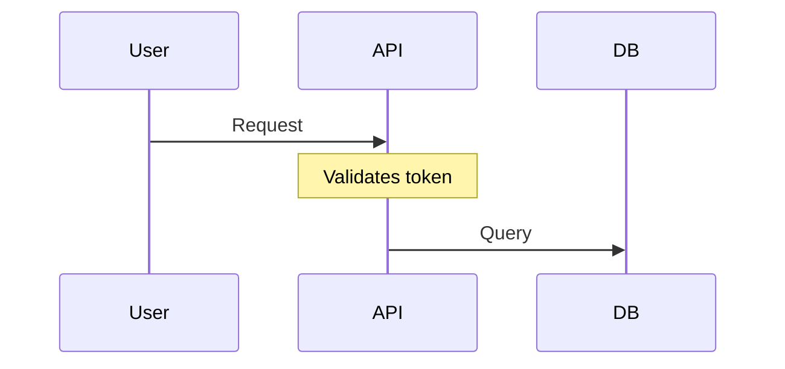

# Diagramas de Arquitectura

Este directorio contiene diagramas Mermaid que ilustran la arquitectura de RAG Corp.

## 📊 Índice de Diagramas

| Diagrama | Archivo | Qué Responde |
|----------|---------|--------------|
| **Componentes** | [components.md](components.md) | ¿Qué servicios hay y cómo se conectan? |
| **Capas** | [layers.md](layers.md) | ¿Cómo se organizan las capas (Domain/Application/Infrastructure)? |
| **Secuencia RAG** | [sequence-rag-flow.md](sequence-rag-flow.md) | ¿Qué pasa cuando un usuario hace una pregunta (endpoint `/v1/ask`)? |

---

## 🎯 Propósito de Cada Diagrama

### [components.md](components.md)
**Tipo:** Diagrama de Componentes (Graph)  
**Cuándo usar:** Para entender la arquitectura de alto nivel del sistema.

**Responde:**
- ¿Qué servicios/componentes existen?
- ¿Cómo se comunican entre sí?
- ¿Qué tecnologías usa cada componente?

**Audiencia:** Nuevos desarrolladores, arquitectos, DevOps

---

### [layers.md](layers.md)
**Tipo:** Diagrama de Capas (Graph)  
**Cuándo usar:** Para entender la Clean Architecture.

**Responde:**
- ¿Qué responsabilidades tiene cada capa?
- ¿Qué depende de qué? (regla de dependencias)
- ¿Dónde va mi código nuevo?

**Audiencia:** Desarrolladores implementando features

---

### [sequence-rag-flow.md](sequence-rag-flow.md)
**Tipo:** Diagrama de Secuencia  
**Cuándo usar:** Para entender el flujo RAG completo (retrieve + generate).

**Responde:**
- ¿Qué pasa cuando un usuario hace una pregunta?
- ¿En qué orden se ejecutan los componentes?
- ¿Qué llamadas externas se hacen (Google API, PostgreSQL)?

**Audiencia:** Desarrolladores debugging, QA, product managers

---

## 🖊️ Convenciones

### Estilo de Diagramas

- **Formato:** Mermaid (diagrams-as-code)
- **Sintaxis:** Markdown code blocks con ` ```mermaid `
- **Nombres:** kebab-case (ejemplo: `sequence-rag-flow.md`)

### Nomenclatura

- **Servicios:** Nombre + tecnología (ejemplo: `FastAPI Server`)
- **Componentes externos:** Icono + nombre (ejemplo: `🗄️ PostgreSQL`)
- **Capas:** Bold + descripción (ejemplo: `**Domain Layer**`)

---

## 🔄 Cómo Actualizar Diagramas

### Cuando Cambiar un Diagrama

**Debes actualizar los diagramas cuando:**
- Agregas un nuevo endpoint → actualizar `sequence-rag-flow.md` si aplica
- Cambias la arquitectura de capas → actualizar `layers.md`
- Agregas un servicio externo → actualizar `components.md`
- Modificas el flujo RAG → actualizar `sequence-rag-flow.md`

### Proceso de Actualización

1. **Editar localmente:**
   ```bash
   # Usar VSCode con extensión Markdown Preview Mermaid
   code doc/diagrams/sequence-rag-flow.md
   ```

2. **Preview en tiempo real:**
   - VSCode: `Cmd+Shift+V` (Mac) / `Ctrl+Shift+V` (Windows)
   - Online: https://mermaid.live/

3. **Validar sintaxis:**
   - El diagrama debe renderizar sin errores
   - Verificar legibilidad (no muy grande/pequeño)

4. **Commit con cambios de código:**
   ```bash
   git add doc/diagrams/sequence-rag-flow.md
   git add services/rag-api/app/routes.py
   git commit -m "feat: add /v1/chat endpoint + update sequence diagram"
   ```

---

## 📚 Recursos para Mermaid

### Documentación Oficial
- **Mermaid Docs:** https://mermaid.js.org/
- **Sequence Diagrams:** https://mermaid.js.org/syntax/sequenceDiagram.html
- **Flowcharts:** https://mermaid.js.org/syntax/flowchart.html

### Herramientas
- **Mermaid Live Editor:** https://mermaid.live/
- **VSCode Extension:** Markdown Preview Mermaid Support
- **GitHub:** Renderiza Mermaid automáticamente en archivos `.md`

---

## 🛠️ Tips y Mejores Prácticas

### 1. Mantén los Diagramas Simples
- **Máximo 10-15 componentes** por diagrama
- Si es más complejo, divide en múltiples diagramas

### 2. Agrega Notas Contextuales


### 3. Documenta Decisiones No Obvias
Si un flujo es complejo, agrega texto explicativo antes/después del diagrama.

---

**Last Updated:** 2025-12-30  
**Maintainer:** Engineering Team
