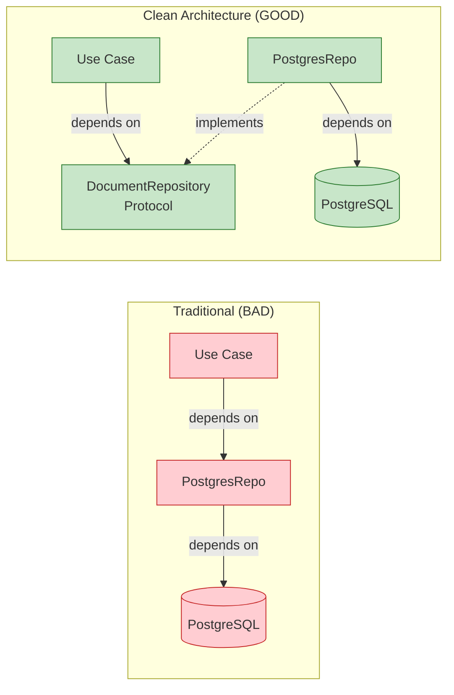
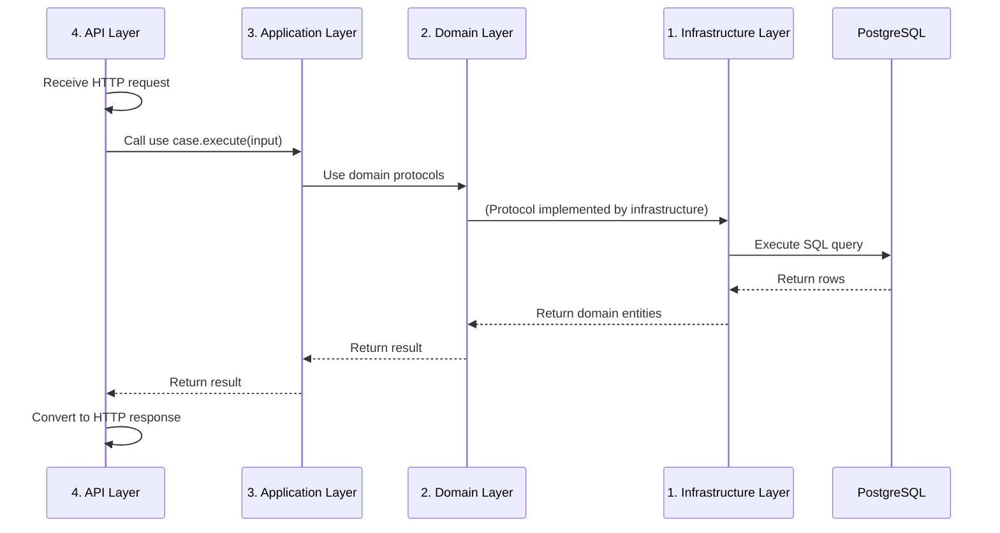

# Architecture Layers Diagram

**Project:** RAG Corp  
**Last Updated:** 2025-12-30

This diagram illustrates the Clean Architecture layer structure and dependency rules.

---

## Clean Architecture Layers

```mermaid
graph TB
    subgraph "1. Domain Layer (Core)"
        direction TB
        Entities[<b>Entities</b><br/>Document, Chunk,<br/>QueryResult]
        Protocols[<b>Protocols</b><br/>DocumentRepository,<br/>EmbeddingService,<br/>LLMService]
        
        Entities -.defined with.- Protocols
    end
    
    subgraph "2. Application Layer (Use Cases)"
        direction TB
        UseCases[<b>Use Cases</b><br/>AnswerQueryUseCase<br/>IngestDocumentUseCase (planned)<br/>SearchChunksUseCase (planned)]
        InputDTOs[<b>Input DTOs</b><br/>AnswerQueryInput]
        
        UseCases -.uses.- InputDTOs
    end
    
    subgraph "3. Infrastructure Layer (Adapters)"
        direction TB
        Repositories[<b>Repositories</b><br/>PostgresDocumentRepo]
        Services[<b>Services</b><br/>GoogleEmbeddingService<br/>GoogleLLMService]
        Utils[<b>Utilities</b><br/>TextChunker]
        
        Repositories -.uses.- Services
        Services -.uses.- Utils
    end
    
    subgraph "4. API Layer (Framework)"
        direction TB
        Routes[<b>HTTP Routes</b><br/>POST /v1/ask<br/>POST /v1/ingest/text<br/>POST /v1/query]
        DTOs[<b>Request/Response</b><br/>QueryReq, AskRes,<br/>IngestTextReq/Res]
        Container[<b>DI Container</b><br/>Dependency factories]
        
        Routes -.uses.- DTOs
        Routes -.uses.- Container
    end
    
    subgraph "External Systems"
        direction LR
        DB[(PostgreSQL<br/>+ pgvector)]
        Gemini[Gemini API]
    end
    
    %% Dependency arrows (point inward)
    UseCases -->|depends on| Protocols
    UseCases -->|depends on| Entities
    Repositories -->|implements| Protocols
    Services -->|implements| Protocols
    Routes -->|depends on| UseCases
    Container -->|creates| UseCases
    Container -->|creates| Repositories
    Container -->|creates| Services
    
    %% External dependencies
    Repositories -.calls.-> DB
    Services -.calls.-> Gemini
    
    %% Styling
    classDef domain fill:#fff9c4,stroke:#f57f17,stroke-width:3px,color:#000
    classDef application fill:#c5e1a5,stroke:#558b2f,stroke-width:3px,color:#000
    classDef infra fill:#ffccbc,stroke:#d84315,stroke-width:3px,color:#000
    classDef api fill:#bbdefb,stroke:#1976d2,stroke-width:3px,color:#000
    classDef external fill:#f48fb1,stroke:#c2185b,stroke-width:2px,color:#000
    
    class Entities,Protocols domain
    class UseCases,InputDTOs application
    class Repositories,Services,Utils infra
    class Routes,DTOs,Container api
    class DB,Gemini external
```

---

## Dependency Rules

### ✅ Allowed Dependencies

```
API Layer
    ↓ (can depend on)
Application Layer
    ↓ (can depend on)
Domain Layer
    ↑ (implements)
Infrastructure Layer
```

### ❌ Forbidden Dependencies

- Domain layer CANNOT depend on Application, Infrastructure, or API
- Application layer CANNOT depend on Infrastructure or API
- Infrastructure layer CANNOT depend on API

### The Dependency Inversion Principle

**Core Idea:** High-level policy (use cases) should not depend on low-level details (databases, APIs).



**Result:** Use case can work with ANY implementation (PostgreSQL, MongoDB, in-memory, etc.)

---

## Layer Responsibilities

### 1. Domain Layer (Innermost)

**Purpose:** Core business logic and entities  
**Location:** `services/rag-api/app/domain/`  
**Dependencies:** NONE (pure Python)

#### Files

```
domain/
├── entities.py         # Document, Chunk, QueryResult dataclasses
├── repositories.py     # DocumentRepository Protocol
└── services.py         # EmbeddingService, LLMService Protocols
```

#### Example

```python
# entities.py
@dataclass
class Document:
    """Business entity (no framework coupling)."""
    id: UUID
    title: str
    source: str | None
    metadata: dict

# repositories.py
class DocumentRepository(Protocol):
    """Contract (not implementation)."""
    def find_similar_chunks(self, embedding, top_k) -> list[Chunk]: ...
```

**Key Principles:**
- ✅ Pure Python (no imports from outer layers)
- ✅ Framework-independent
- ✅ No external dependencies (psycopg, FastAPI, etc.)

---

### 2. Application Layer

**Purpose:** Business workflows (use cases)  
**Location:** `services/rag-api/app/application/use_cases/`  
**Dependencies:** Domain layer only

#### Files

```
application/
└── use_cases/
    ├── answer_query.py
    ├── ingest_document.py  (planned)
    └── search_chunks.py     (planned)
```

#### Example

```python
# answer_query.py
class AnswerQueryUseCase:
    def __init__(
        self,
        repository: DocumentRepository,      # Protocol (domain)
        embedding_service: EmbeddingService, # Protocol (domain)
        llm_service: LLMService              # Protocol (domain)
    ):
        self.repository = repository
        self.embedding_service = embedding_service
        self.llm_service = llm_service
    
    def execute(self, input: AnswerQueryInput) -> QueryResult:
        # Business logic (framework-agnostic)
        query_embedding = self.embedding_service.embed_query(input.query)
        chunks = self.repository.find_similar_chunks(
            embedding=query_embedding,
            top_k=5
        )
        context = self._build_context(chunks)
        answer = self.llm_service.generate_answer(input.query, context)
        return QueryResult(answer=answer, chunks=chunks)
```

**Key Principles:**
- ✅ Depends on protocols (abstractions), not implementations
- ✅ Framework-agnostic (no FastAPI coupling)
- ✅ Testable without external services

---

### 3. Infrastructure Layer

**Purpose:** Implement domain protocols with concrete technologies  
**Location:** `services/rag-api/app/infrastructure/`  
**Dependencies:** Domain layer (implements protocols)

#### Files

```
infrastructure/
├── repositories/
│   └── postgres_document_repo.py   # DocumentRepository impl
├── services/
│   ├── google_embedding_service.py # EmbeddingService impl
│   └── google_llm_service.py       # LLMService impl
└── text/
    └── chunker.py                  # Utility
```

#### Example

```python
# postgres_document_repo.py
import psycopg  # External dependency OK here
from app.domain.repositories import DocumentRepository  # Implements protocol

class PostgresDocumentRepository:
    """Adapter: Implements DocumentRepository using PostgreSQL."""
    
    def __init__(self, connection_string: str):
        self.connection_string = connection_string
    
    def find_similar_chunks(
        self, 
        embedding: list[float], 
        top_k: int
    ) -> list[Chunk]:
        """Implement protocol method."""
        with psycopg.connect(self.connection_string) as conn:
            # PostgreSQL-specific code
            ...
```

**Key Principles:**
- ✅ Implements domain protocols
- ✅ Can use external libraries (psycopg, google-generativeai)
- ✅ Swappable (easy to replace PostgreSQL with MongoDB)

---

### 4. API Layer (Outermost)

**Purpose:** HTTP endpoint definitions and framework integration  
**Location:** `services/rag-api/app/routes.py`, `main.py`  
**Dependencies:** Application layer (uses use cases)

#### Files

```
app/
├── routes.py       # HTTP endpoints
├── main.py         # FastAPI app initialization
└── container.py    # Dependency injection factories
```

#### Example

```python
# routes.py
from fastapi import APIRouter, Depends
from app.application.use_cases.answer_query import AnswerQueryUseCase
from app.container import get_answer_query_use_case

router = APIRouter()

@router.post("/ask")
def answer_query(
    request: QueryReq,  # HTTP DTO
    use_case: AnswerQueryUseCase = Depends(get_answer_query_use_case)
) -> AskRes:
    """
    HTTP adapter for AnswerQueryUseCase.
    Converts HTTP request → domain input → domain output → HTTP response.
    """
    # 1. Convert HTTP to domain
    input_dto = AnswerQueryInput(query=request.query, top_k=3)
    
    # 2. Execute business logic (framework-agnostic)
    result = use_case.execute(input_dto)
    
    # 3. Convert domain to HTTP
    return AskRes(
        answer=result.answer,
        sources=[chunk.content for chunk in result.chunks]
    )
```

**Key Principles:**
- ✅ Thin layer (only HTTP concerns)
- ✅ Delegates to use cases (no business logic here)
- ✅ Converts between HTTP DTOs and domain entities

---

## Data Flow Across Layers



**Flow:**
1. API layer receives HTTP request
2. API layer calls use case (application layer)
3. Use case calls protocols (domain layer)
4. Infrastructure implements protocols
5. Infrastructure queries external systems
6. Results bubble back up through layers
7. API layer converts to HTTP response

---

## Folder Structure

```
services/rag-api/app/
│
├── domain/                          # Layer 1: Core Business
│   ├── entities.py                  # Business objects
│   ├── repositories.py              # Data access contracts
│   └── services.py                  # Service contracts
│
├── application/                     # Layer 2: Use Cases
│   └── use_cases/
│       ├── answer_query.py          # RAG Q&A workflow
│       ├── ingest_document.py       # (Planned)
│       └── search_chunks.py         # (Planned)
│
├── infrastructure/                  # Layer 3: Implementations
│   ├── repositories/
│   │   └── postgres_document_repo.py
│   ├── services/
│   │   ├── google_embedding_service.py
│   │   └── google_llm_service.py
│   └── text/
│       └── chunker.py
│
├── routes.py                        # Layer 4: HTTP Endpoints
├── main.py                          # FastAPI app
├── container.py                     # Dependency injection
└── settings.py                      # Configuration
```

---

## Benefits of Layered Architecture

### 1. Testability

Test business logic WITHOUT external dependencies:

```python
# Test use case with fakes (no database, no API)
fake_repo = FakeDocumentRepository(documents=[...])
fake_embedding = FakeEmbeddingService()
fake_llm = FakeLLMService()

use_case = AnswerQueryUseCase(fake_repo, fake_embedding, fake_llm)
result = use_case.execute(AnswerQueryInput(query="test"))

assert result.answer == "Expected answer"
```

**Result:** Tests run in milliseconds.

### 2. Framework Independence

Business logic doesn't know about FastAPI:

```python
# Can be called from:
# - FastAPI endpoint
# - CLI script
# - Celery task
# - Jupyter notebook
# - Unit test

use_case = AnswerQueryUseCase(...)
result = use_case.execute(AnswerQueryInput(query="..."))
```

If you switch from FastAPI to Flask, only API layer changes.

### 3. Database Flexibility

Swap PostgreSQL for MongoDB:

```python
# Before
repository = PostgresDocumentRepository(...)

# After
repository = MongoDocumentRepository(...)

# Use case unchanged!
use_case = AnswerQueryUseCase(repository, ...)
```

### 4. Vendor Independence

A/B test LLM providers:

```python
# Gemini
llm_service = GoogleLLMService(...)

# OpenAI
llm_service = OpenAILLMService(...)

# Anthropic
llm_service = AnthropicLLMService(...)

# Use case works with all!
use_case = AnswerQueryUseCase(..., llm_service)
```

---

## Layer Communication

### Protocols (Interfaces)

Layers communicate via protocols (Python typing.Protocol):

```python
# Domain layer defines contract
class DocumentRepository(Protocol):
    def find_similar_chunks(self, embedding, top_k) -> list[Chunk]: ...

# Infrastructure implements contract
class PostgresDocumentRepository:
    def find_similar_chunks(self, embedding, top_k) -> list[Chunk]:
        # Implementation
        ...

# Application layer uses protocol
class AnswerQueryUseCase:
    def __init__(self, repository: DocumentRepository):  # Protocol type
        self.repository = repository
```

**Key Point:** Use case depends on ABSTRACTION (protocol), not CONCRETE CLASS (PostgresDocumentRepository).

---

## Anti-Patterns to Avoid

### ❌ Domain Depending on Infrastructure

```python
# BAD: Domain importing infrastructure
from app.infrastructure.repositories.postgres_document_repo import PostgresDocumentRepository

class Document:
    def save(self):
        repo = PostgresDocumentRepository()  # ❌ Tight coupling
        repo.save_document(self)
```

### ❌ Application Depending on API

```python
# BAD: Use case importing FastAPI
from fastapi import HTTPException

class AnswerQueryUseCase:
    def execute(self, input):
        if not input.query:
            raise HTTPException(400)  # ❌ Framework coupling
```

### ❌ Business Logic in API Layer

```python
# BAD: Business logic in routes.py
@router.post("/ask")
async def answer_query(request):
    # ❌ All business logic here (no use case)
    embedding = embed_query(request.query)
    chunks = search_db(embedding)
    answer = generate_answer(chunks)
    return {"answer": answer}
```

---

## References

- **Clean Architecture Book:** [Robert C. Martin](https://www.amazon.com/Clean-Architecture-Craftsmans-Software-Structure/dp/0134494164)
- **Clean Architecture Blog:** [Uncle Bob](https://blog.cleancoder.com/uncle-bob/2012/08/13/the-clean-architecture.html)
- **Design Patterns:** [patterns.md](../design/patterns.md)
- **Architecture Overview:** [overview.md](../architecture/overview.md)

---

**Last Updated:** 2025-12-30  
**Maintainer:** Engineering Team
