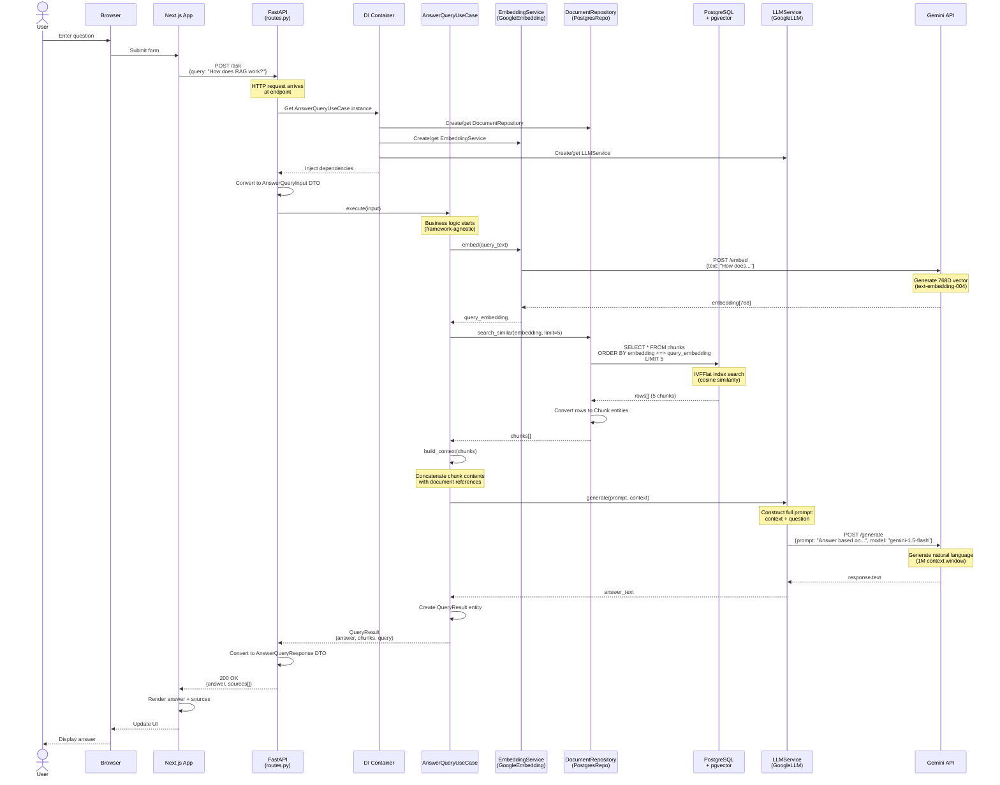
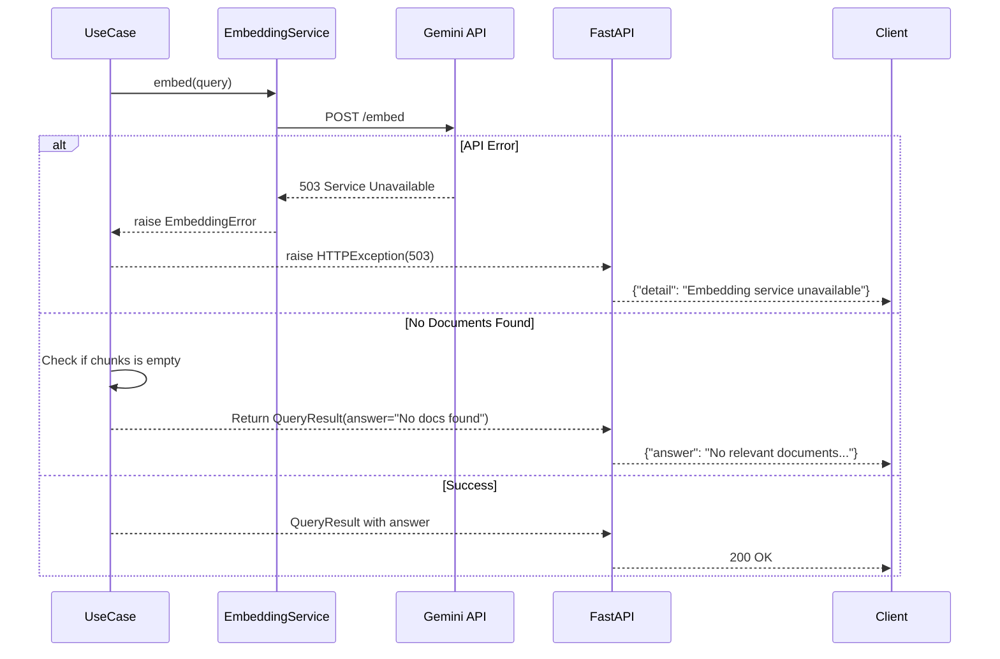
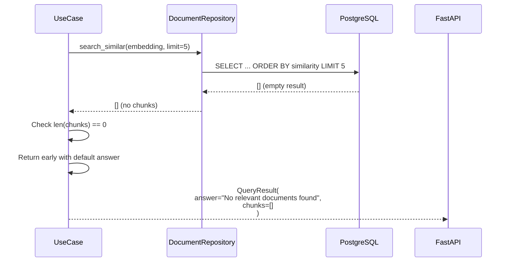

# Sequence Diagram: RAG Flow

**Project:** RAG Corp  
**Use Case:** Answer Query (RAG Q&A)  
**Last Updated:** 2025-12-30

This diagram shows the complete flow of a RAG (Retrieval-Augmented Generation) query through the system.

---

## Complete RAG Flow



---

## Detailed Steps

### 1. User Interaction (Frontend)

```typescript
// User submits query via Next.js form
const handleSubmit = async (query: string) => {
  const response = await fetch('http://localhost:8000/ask', {
    method: 'POST',
    headers: { 'Content-Type': 'application/json' },
    body: JSON.stringify({ query })
  });
  const data = await response.json();
  setAnswer(data.answer);
  setSources(data.sources);
};
```

### 2. HTTP Request (API Layer)

```python
# routes.py
@router.post("/ask")
async def answer_query(
    request: AnswerQueryRequest,  # HTTP DTO
    use_case: AnswerQueryUseCase = Depends(get_answer_query_use_case)
):
    # Convert HTTP to domain
    input_dto = AnswerQueryInput(query=request.query)
    
    # Execute business logic
    result = use_case.execute(input_dto)
    
    # Convert domain to HTTP
    return AnswerQueryResponse(
        answer=result.answer,
        sources=[...],
        confidence="high" if result.chunks else "low"
    )
```

### 3. Dependency Injection (Container)

```python
# container.py
@lru_cache
def get_document_repository() -> DocumentRepository:
    return PostgresDocumentRepository(settings.DATABASE_URL)

@lru_cache
def get_embedding_service() -> EmbeddingService:
    return GoogleEmbeddingService(settings.GEMINI_API_KEY)

@lru_cache
def get_llm_service() -> LLMService:
    return GoogleLLMService(settings.GEMINI_API_KEY)

def get_answer_query_use_case(
    repository: DocumentRepository = Depends(get_document_repository),
    embedding_service: EmbeddingService = Depends(get_embedding_service),
    llm_service: LLMService = Depends(get_llm_service)
) -> AnswerQueryUseCase:
    return AnswerQueryUseCase(repository, embedding_service, llm_service)
```

### 4. Use Case Execution (Application Layer)

```python
# answer_query.py
class AnswerQueryUseCase:
    def execute(self, input: AnswerQueryInput) -> QueryResult:
        # 4a. Embed query
        query_embedding = self.embedding_service.embed(input.query)
        
        # 4b. Retrieve similar chunks
        chunks = self.repository.search_similar(
            query_embedding, 
            limit=input.limit or 5
        )
        
        # 4c. Build context
        context = self._build_context(chunks)
        
        # 4d. Generate answer
        prompt = self._build_prompt(input.query, context)
        answer = self.llm_service.generate(prompt)
        
        # 4e. Return result
        return QueryResult(
            query=input.query,
            answer=answer,
            chunks=chunks
        )
```

### 5. Embedding Generation (Infrastructure)

```python
# google_embedding_service.py
class GoogleEmbeddingService:
    def embed(self, text: str) -> list[float]:
        result = genai.embed_content(
            model="models/text-embedding-004",
            content=text,
            task_type="retrieval_query"
        )
        return result['embedding']  # 768 dimensions
```

### 6. Vector Similarity Search (Infrastructure + Database)

```python
# postgres_document_repo.py
class PostgresDocumentRepository:
    def search_similar(
        self, 
        embedding: list[float], 
        limit: int
    ) -> list[Chunk]:
        with psycopg.connect(self.connection_string) as conn:
            with conn.cursor(row_factory=dict_row) as cur:
                cur.execute("""
                    SELECT 
                        id, doc_id, chunk_index, content, embedding,
                        1 - (embedding <=> %s::vector) AS similarity
                    FROM chunks
                    WHERE embedding IS NOT NULL
                    ORDER BY embedding <=> %s::vector
                    LIMIT %s
                """, (embedding, embedding, limit))
                
                rows = cur.fetchall()
                return [Chunk(**row) for row in rows]
```

**PostgreSQL Query:**
- Uses pgvector's `<=>` operator (cosine distance)
- IVFFlat index accelerates search (~10ms for 50K vectors)
- Returns top-N most similar chunks

### 7. Context Building (Application Layer)

```python
# answer_query.py
def _build_context(self, chunks: list[Chunk]) -> str:
    """Concatenate chunk contents with source references."""
    context_parts = []
    
    for chunk in chunks:
        context_parts.append(
            f"[Source: {chunk.doc_id}, Part {chunk.index}]\n"
            f"{chunk.content}\n"
        )
    
    return "\n".join(context_parts)
```

**Example Context:**
```
[Source: user-guide, Part 0]
RAG Corp is a retrieval-augmented generation system...

[Source: architecture-doc, Part 2]
The system uses Google Gemini for embeddings...

[Source: user-guide, Part 1]
Documents are chunked into 900-character segments...
```

### 8. LLM Answer Generation (Infrastructure)

```python
# google_llm_service.py
class GoogleLLMService:
    def generate(self, prompt: str) -> str:
        response = self.model.generate_content(
            prompt,
            generation_config={
                "temperature": 0.7,
                "max_output_tokens": 500
            }
        )
        return response.text
```

**Full Prompt:**
```
Answer the following question based on the provided context.

Context:
[Source: user-guide, Part 0]
RAG Corp is a retrieval-augmented generation system...

[Source: architecture-doc, Part 2]
The system uses Google Gemini for embeddings...

Question: How does RAG Corp work?

Answer:
```

**Gemini Response:**
```
RAG Corp works by combining retrieval and generation. First, it converts 
your query into a vector embedding. Then, it searches a vector database 
to find the most semantically similar document chunks. Finally, it uses 
those chunks as context to generate a natural language answer with Gemini.
```

### 9. Response Conversion (API Layer)

```python
# Convert domain entity to HTTP response
return AnswerQueryResponse(
    answer=result.answer,
    sources=[
        SourceReference(
            doc_id=chunk.doc_id,
            chunk_index=chunk.index,
            content=chunk.content[:200],  # Truncate
            similarity=chunk.similarity
        )
        for chunk in result.chunks
    ],
    confidence="high" if any(c.similarity > 0.8 for c in result.chunks) else "medium"
)
```

---

## Timing Breakdown

Typical latency for each step (50K documents, cold start):

| Step | Component | Latency | Notes |
|------|-----------|---------|-------|
| 1 | HTTP request | ~5ms | Network + parsing |
| 2 | Dependency injection | ~1ms | Cached singletons |
| 3 | Query embedding | ~200ms | **Gemini API call** |
| 4 | Vector search | ~10ms | IVFFlat index (pgvector) |
| 5 | Context building | ~1ms | String concatenation |
| 6 | LLM generation | ~1500ms | **Gemini API call** (Flash model) |
| 7 | Response conversion | ~1ms | JSON serialization |
| **Total** | | **~1720ms** | **Dominated by LLM latency** |

**Optimization Opportunities:**
- Cache frequent queries (Redis)
- Use streaming for LLM responses
- Upgrade to faster LLM model (higher cost)
- Batch embedding requests

---

## Error Handling Flow



---

## Alternative Flow: No Results

What happens when no relevant documents are found?



**Response:**
```json
{
  "query": "What is quantum computing?",
  "answer": "No relevant documents found for your query. Please try a different question or ensure documents have been ingested.",
  "sources": [],
  "confidence": "low"
}
```

---

## References

- **Use Case Implementation:** [services/rag-api/app/application/use_cases/answer_query.py](../../../services/rag-api/app/application/use_cases/answer_query.py)
- **Repository Implementation:** [services/rag-api/app/infrastructure/repositories/postgres_document_repo.py](../../../services/rag-api/app/infrastructure/repositories/postgres_document_repo.py)
- **API Endpoint:** [services/rag-api/app/routes.py](../../../services/rag-api/app/routes.py)
- **Component Diagram:** [components.md](components.md)

---

**Last Updated:** 2025-12-30  
**Maintainer:** Engineering Team
