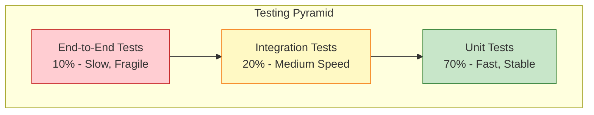

# Testing Strategy

**Project:** RAG Corp  
**Last Updated:** 2025-12-30

This document outlines the testing strategy for RAG Corp, covering unit tests, integration tests, and end-to-end tests.

---

## Table of Contents

1. [Overview](#overview)
2. [Testing Pyramid](#testing-pyramid)
3. [Unit Tests](#unit-tests)
4. [Integration Tests](#integration-tests)
5. [End-to-End Tests](#end-to-end-tests)
6. [Test Infrastructure](#test-infrastructure)
7. [CI/CD Integration](#cicd-integration)
8. [Coverage Goals](#coverage-goals)

---

## Overview

### Testing Philosophy

RAG Corp follows a **test-driven mindset** with emphasis on:

- **Fast feedback:** Unit tests run in milliseconds
- **Reliability:** Tests should not flake
- **Maintainability:** Tests are first-class code
- **Documentation:** Tests demonstrate how code should be used

### Current State

**Status:** ✅ Test suite backend presente (ver `services/rag-api/tests`)

**Achieved:**
- Tests unitarios e integración en backend
- Cobertura mínima configurada en `services/rag-api/pytest.ini` (`--cov-fail-under=70`)

**Planned:**
- Tests frontend y E2E

---

## Testing Pyramid



### Distribution (Target)

| Test Type | Percentage | Execution Time |
|-----------|------------|----------------|
| **Unit Tests** | 70% | < 1 second |
| **Integration Tests** | 20% | 5-10 seconds |
| **E2E Tests** | 10% | 30-60 seconds |

---

## Unit Tests

### Purpose

Test individual components in isolation without external dependencies.

### Scope

- **Domain entities:** Document, Chunk, QueryResult
- **Use cases:** AnswerQueryUseCase (implementado), IngestDocumentUseCase (planned)
- **Infrastructure services:** GoogleEmbeddingService, GoogleLLMService (with mocks)
- **Utilities:** TextChunker

### Framework

**Backend:** pytest  
**Frontend:** TODO (sin framework de tests configurado)

### Example: Test Use Case

```python
# test_answer_query_use_case.py
import pytest
from unittest.mock import Mock
from uuid import uuid4
from app.domain.entities import Chunk, QueryResult
from app.application.use_cases.answer_query import (
    AnswerQueryUseCase,
    AnswerQueryInput
)

def test_answer_query_with_results():
    # Arrange: Create mocks
    mock_repository = Mock()
    mock_repository.find_similar_chunks.return_value = [
        Chunk(
            chunk_id=uuid4(),
            document_id=uuid4(),
            chunk_index=0,
            content="RAG Corp is a system for document Q&A.",
            embedding=[0.1] * 768,
        )
    ]
    
    mock_embedding_service = Mock()
    mock_embedding_service.embed_query.return_value = [0.1] * 768
    
    mock_llm_service = Mock()
    mock_llm_service.generate_answer.return_value = (
        "RAG Corp is a retrieval-augmented generation system."
    )
    
    # Act: Execute use case with mocks
    use_case = AnswerQueryUseCase(
        repository=mock_repository,
        embedding_service=mock_embedding_service,
        llm_service=mock_llm_service
    )
    
    result = use_case.execute(AnswerQueryInput(query="What is RAG Corp?"))
    
    # Assert: Verify behavior
    assert result.answer == "RAG Corp is a retrieval-augmented generation system."
    assert len(result.chunks) == 1
    assert result.chunks[0].document_id is not None
    
    # Verify interactions
    mock_embedding_service.embed_query.assert_called_once_with("What is RAG Corp?")
    mock_repository.find_similar_chunks.assert_called_once()
    mock_llm_service.generate_answer.assert_called_once()
```

Para más casos reales, ver `services/rag-api/tests/unit/`.

### Running Unit Tests

```bash
# Run all unit tests
cd services/rag-api
pytest tests/unit/ -v

# Run with coverage
pytest tests/unit/ --cov=app --cov-report=html

# Run specific test
pytest tests/unit/test_answer_query_use_case.py::test_answer_query_with_results -v

```

---

## Integration Tests

### Purpose

Test components working together with real external dependencies (database, APIs).

### Scope

- **Repository tests:** PostgresDocumentRepository with real database
- **Service tests:** GoogleEmbeddingService with real Gemini API (or mocked)
- **API endpoint tests:** FastAPI routes with TestClient

### Framework

**Backend:** pytest + pytest-asyncio + TestClient (FastAPI)

Ver ejemplos actuales en `services/rag-api/tests/integration/`.

### Running Integration Tests

```bash
# Start database
docker compose up -d db

# Run integration tests
pytest tests/integration/ -v
```

---

## End-to-End Tests

### Purpose

Test complete user workflows from frontend to backend to database.

### Scope

- User uploads document via UI → Backend ingests → Database stores
- User asks question via UI → Backend retrieves + generates → UI displays answer

### Framework

**Tool:** TODO/Planned - Playwright (Python or TypeScript)

### Example: E2E Test

TODO: no hay tests E2E implementados todavia.

## CI/CD Integration

TODO: no hay pipeline CI/CD configurado todavia.

## Coverage Goals

### Target Coverage

- **Overall:** 70% (configurado en `services/rag-api/pytest.ini`)
- **Componentes:** TODO (definir objetivos por capa)

### Measuring Coverage

```bash
# Generate coverage report
pytest --cov=app --cov-report=html --cov-report=term

# View HTML report
open htmlcov/index.html

# Check coverage threshold (fails if below 70%)
pytest --cov=app --cov-fail-under=70
```

---

## Best Practices

### 1. AAA Pattern

**Arrange-Act-Assert:**
```python
def test_example():
    # Arrange: Set up test data
    input_data = AnswerQueryInput(query="test")
    
    # Act: Execute the code under test
    result = use_case.execute(input_data)
    
    # Assert: Verify the outcome
    assert result.answer == "expected"
```

### 2. Test Naming

**Convention:** `test_<unit>_<scenario>_<expected_result>`

```python
def test_answer_query_with_results_returns_answer():
    ...

def test_answer_query_no_results_returns_default_message():
    ...

def test_answer_query_invalid_input_raises_validation_error():
    ...
```

### 3. Avoid Test Interdependence

```python
# ❌ BAD: Tests depend on execution order
def test_create_document():
    repo.save_document(document)

def test_find_similar_chunks():
    results = repo.find_similar_chunks(query_embedding, top_k=1)
    assert results  # Depends on previous test

# ✅ GOOD: Each test is independent
def test_find_similar_chunks(clean_db):
    repo.save_document(document)
    repo.save_chunks(document.id, [chunk])
    results = repo.find_similar_chunks(query_embedding, top_k=1)
    assert results
```

### 4. Use Fixtures for Common Setup

```python
@pytest.fixture
def use_case_with_mocks():
    """Reusable fixture for use case with mocked dependencies."""
    return AnswerQueryUseCase(
        repository=Mock(),
        embedding_service=Mock(),
        llm_service=Mock()
    )

def test_scenario_1(use_case_with_mocks):
    result = use_case_with_mocks.execute(...)
    ...

def test_scenario_2(use_case_with_mocks):
    result = use_case_with_mocks.execute(...)
    ...
```

---

## References

- **pytest Documentation:** https://docs.pytest.org/
- **FastAPI Testing:** https://fastapi.tiangolo.com/tutorial/testing/
- **Playwright:** https://playwright.dev/python/
- **pytest-cov:** https://pytest-cov.readthedocs.io/

---

**Last Updated:** 2025-12-30  
**Maintainer:** Engineering Team
