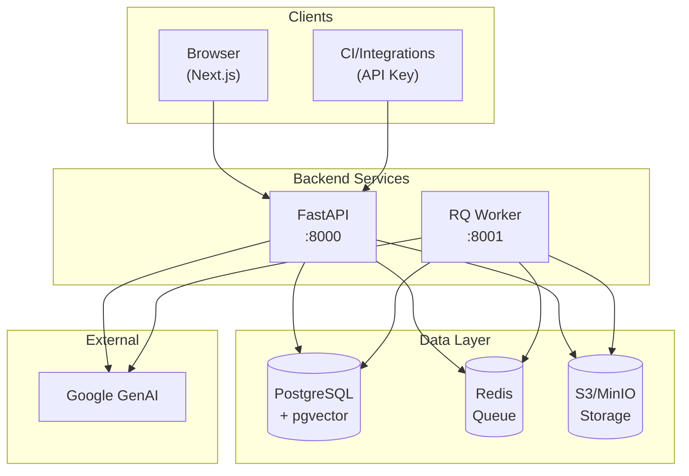
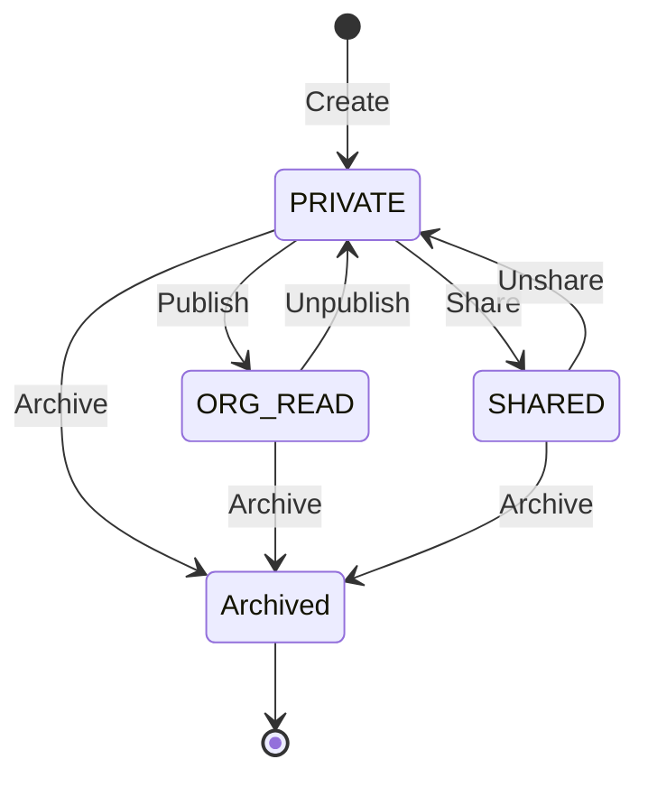

# Architecture Overview — RAG Corp v6

**Project:** RAG Corp  
**Last Updated:** 2026-01-24  
**Status:** Active  
**Source of Truth:** Este documento + ADRs en `docs/architecture/decisions/`

---

## TL;DR

RAG Corp es un sistema de Retrieval-Augmented Generation (RAG) empresarial con:
- **Workspaces** como unidad de organización y permisos
- **Clean Architecture** (Domain/Application/Infrastructure)
- **Procesamiento asíncrono** de documentos (RQ Worker)
- **PostgreSQL + pgvector** para almacenamiento vectorial

---

## System Purpose

RAG Corp permite a organizaciones:
1. **Organizar conocimiento** en workspaces con control de acceso
2. **Ingestar documentos** (PDF, DOCX, texto) con procesamiento automático
3. **Consultar** con lenguaje natural obteniendo respuestas basadas en fuentes

**Principio clave:** Todas las operaciones están **scoped por `workspace_id`** — no hay cross-workspace data leaks.

---

## High-Level Architecture



**Diagrama completo:** Ver `docs/diagrams/deployment.mmd`

---

## Core Components

| Component | Technology | Purpose | Port |
|-----------|------------|---------|------|
| Frontend | Next.js 16.1.1 | UI para workspaces, documentos y chat | 3000 |
| Backend | FastAPI (Python 3.11) | API HTTP y orquestación | 8000 |
| Worker | RQ + Redis | Procesamiento async de uploads | 8001 |
| Vector DB | PostgreSQL 16 + pgvector 0.8.1 | Chunks + embeddings | 5432 |
| Queue | Redis 7 | Cola de jobs | 6379 |
| Storage | S3/MinIO | Archivos binarios | 9000 |
| Observability | Prometheus/Grafana | Métricas y dashboards | 9090/3001 |

---

## Architecture Layers (Clean Architecture)

RAG Corp sigue **Clean Architecture** para separar responsabilidades y facilitar testing/evolución.

```
┌────────────────────────────────────────────────────┐
│                    API Layer                        │
│     FastAPI routes, middleware, auth, SSE          │
├────────────────────────────────────────────────────┤
│                Application Layer                    │
│     Use Cases, DTOs, Policies, Orchestration       │
├────────────────────────────────────────────────────┤
│                  Domain Layer                       │
│     Entities, Ports (Protocols), Business Rules    │
├────────────────────────────────────────────────────┤
│               Infrastructure Layer                  │
│     PostgreSQL, Google APIs, S3, Redis, Cache      │
└────────────────────────────────────────────────────┘
```

### Domain (`apps/backend/app/domain/`)

Contiene la lógica de negocio pura, sin dependencias externas.

- **Entities:** `Workspace`, `Document`, `Chunk`, `User`, `AuditEvent`
- **Policies:** `WorkspacePolicy` (autorización centralizada)
- **Ports (Protocols):** Interfaces para repositorios y servicios

```python
# Ejemplo: WorkspacePolicy
class WorkspacePolicy:
    def can_read(self, actor: User, workspace: Workspace, acl: List[AclEntry]) -> bool:
        if actor.role == "admin":
            return True
        if workspace.owner_user_id == actor.id:
            return True
        if workspace.visibility == "ORG_READ":
            return True
        if workspace.visibility == "SHARED":
            return any(e.user_id == actor.id for e in acl)
        return False
```

### Application (`apps/backend/app/application/`)

Orquesta casos de uso. No conoce FastAPI ni PostgreSQL.

- **Use Cases:** `AnswerQueryUseCase`, `IngestDocumentUseCase`, `CreateWorkspaceUseCase`
- **DTOs:** Input/Output explícitos
- **Context Builder:** Prepara contexto para LLM

### Infrastructure (`apps/backend/app/infrastructure/`)

Implementa los ports del dominio.

- **Repositories:** `PostgresDocumentRepository`, `PostgresWorkspaceRepository`
- **Services:** `GoogleEmbeddingService`, `GoogleLLMService`
- **Storage:** `S3FileStorageAdapter`
- **Queue:** `RQDocumentProcessingQueue`
- **Cache:** `EmbeddingCache` (memory o Redis)

### API (`apps/backend/app/`)

Capa de presentación HTTP.

- **Routes:** FastAPI routers versionados (`/v1/...`)
- **Auth:** JWT + API Key dual auth
- **Middleware:** CORS, error handling, metrics
- **SSE:** Streaming para `/ask/stream`

---

## Workspace Scoping (v6)

**Regla principal:** Toda operación de documentos y RAG requiere `workspace_id`.

### Endpoints canónicos (nested)

```
/v1/workspaces/{workspace_id}/documents
/v1/workspaces/{workspace_id}/documents/{document_id}
/v1/workspaces/{workspace_id}/ask
/v1/workspaces/{workspace_id}/query
```

### Visibilidad

| Visibility | Quién puede ver | Quién puede escribir |
|------------|-----------------|----------------------|
| `PRIVATE` | Solo owner + admin | Owner + admin |
| `ORG_READ` | Todos en la org | Owner + admin |
| `SHARED` | Solo en ACL + admin | Owner + admin |

### Política de acceso

```python
# Centralizada en apps/backend/app/domain/workspace_policy.py
can_read(actor, workspace, acl)   # Ver, listar, chat
can_write(actor, workspace)        # Upload, delete, reprocess
can_admin(actor, workspace)        # Publicar, compartir, archivar
```

---

## Key Flows

### 1. Workspace Lifecycle



### 2. Upload Async (Scoped)

1. `POST /v1/workspaces/{ws_id}/documents/upload`
2. API guarda metadata (PENDING) y binario en S3/MinIO
3. Job encolado en Redis
4. Worker procesa: extract → chunk → embed → persist
5. Estado: `PROCESSING` → `READY` / `FAILED`

**Diagrama:** `docs/diagrams/sequence-upload-async.mmd`

### 3. Ask/Query (Scoped)

1. `POST /v1/workspaces/{ws_id}/ask`
2. Validar acceso (WorkspacePolicy)
3. Embed query → Vector search **filtrado por workspace**
4. Build context → LLM generate → Return answer + sources

**Diagrama:** `docs/diagrams/sequence-ask-scoped.mmd`

---

## Data Flow

```
User → Frontend → API → PostgreSQL (metadata)
                      → S3/MinIO (binarios)
                      → Redis (jobs)
                      
Redis → Worker → S3 (download)
              → GenAI (embeddings)
              → PostgreSQL (chunks + vectors)
              
User → Frontend → API → PostgreSQL (vector search)
                      → GenAI (LLM)
                      → Response
```

---

## Source of Truth

| Aspecto | Fuente |
|---------|--------|
| API Contracts | `shared/contracts/openapi.json` |
| DB Schema | `apps/backend/alembic/versions/` |
| Decisiones | `docs/architecture/decisions/ADR-*.md` |
| Config | `apps/backend/app/crosscutting/config.py` |

---

## ADRs (Architecture Decision Records)

| ADR | Título | Estado |
|-----|--------|--------|
| ADR-001 | Clean Architecture | Accepted |
| ADR-002 | PostgreSQL + pgvector | Accepted |
| ADR-003 | Google Gemini | Accepted |
| ADR-004 | Naming: Workspace vs Sección | Accepted |
| ADR-005 | Workspace Uniqueness | Accepted |
| ADR-006 | Archive / Soft Delete | Accepted |
| ADR-007 | Legacy Endpoints | Accepted |

---

## Context Assembly (RAG Quality)

El sistema ensambla contexto para el LLM con:

- **Prompts versionados:** `apps/backend/app/prompts/`
- **Context builder:** `apps/backend/app/application/context_builder.py`
- **Límites configurables:**
  - `MAX_CONTEXT_CHARS`: Máximo caracteres de contexto
  - `MAX_SOURCES`: Máximo chunks a incluir
  - `PROMPT_VERSION`: Versión del prompt

---

## Observability

| Componente | Endpoints |
|------------|-----------|
| API | `/healthz`, `/readyz`, `/metrics` |
| Worker | `/healthz`, `/readyz`, `/metrics` (puerto 8001) |

**Perfiles Compose:**
- `observability`: Prometheus + Grafana
- `full`: Todo incluyendo worker + storage + observability

**Ver:** `docs/runbook/observability.md`

---

## Security Model

### Authentication

- **JWT:** Para UI (cookies httpOnly)
- **API Keys:** Para integraciones (header `X-API-Key`)

### Authorization

- **Role-based:** `admin` (todo), `employee` (limitado)
- **Workspace-based:** Owner/Viewer via WorkspacePolicy
- **RBAC para API Keys:** Scopes configurables

### Hardening (Producción)

- `JWT_SECRET` obligatorio (fail-fast si default)
- `METRICS_REQUIRE_AUTH=true`
- Cookies `Secure` + `SameSite`
- CSP headers

---

## Diagrams Index

| Diagrama | Ubicación | Descripción |
|----------|-----------|-------------|
| Components | `docs/diagrams/components.mmd` | Componentes del sistema |
| Deployment | `docs/diagrams/deployment.mmd` | Stack Docker Compose |
| Login | `docs/diagrams/sequence-login.mmd` | Flujo de autenticación |
| Upload Async | `docs/diagrams/sequence-upload-async.mmd` | Flujo de upload |
| Ask Scoped | `docs/diagrams/sequence-ask-scoped.mmd` | Flujo de consulta |
| Domain Classes | `docs/diagrams/domain-class.mmd` | Clases del dominio |
| ER | `docs/diagrams/data-er.mmd` | Modelo de datos |
| Document State | `docs/diagrams/document-state.mmd` | Estados del documento |

---

## References

- Informe de Sistemas: `docs/system/informe_de_sistemas_rag_corp.md`
- API HTTP: `docs/api/http-api.md`
- PostgreSQL Schema: `docs/data/postgres-schema.md`
- Design Patterns: `docs/design/patterns.md`
