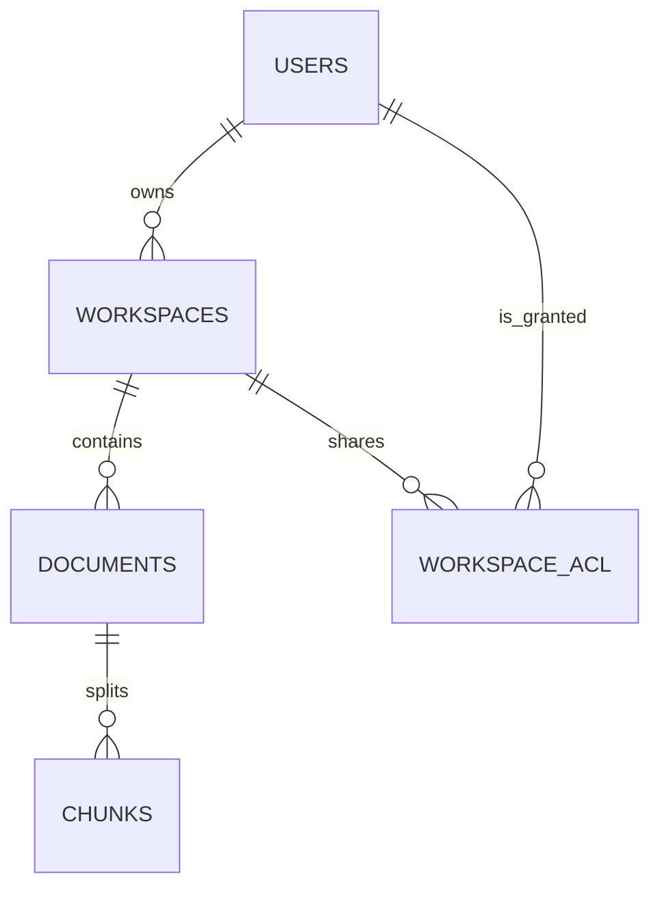
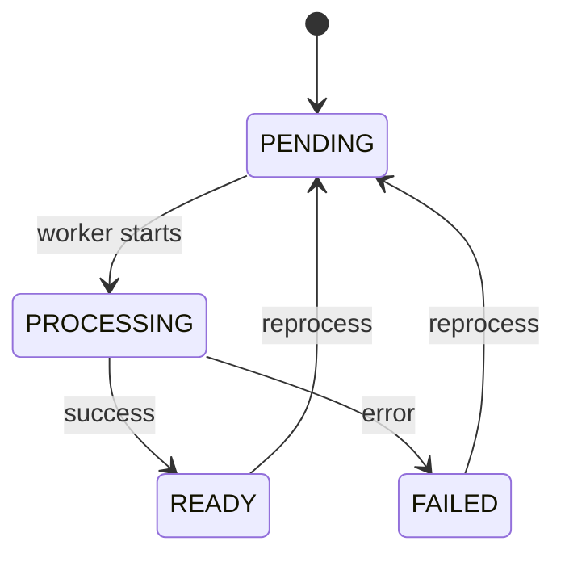
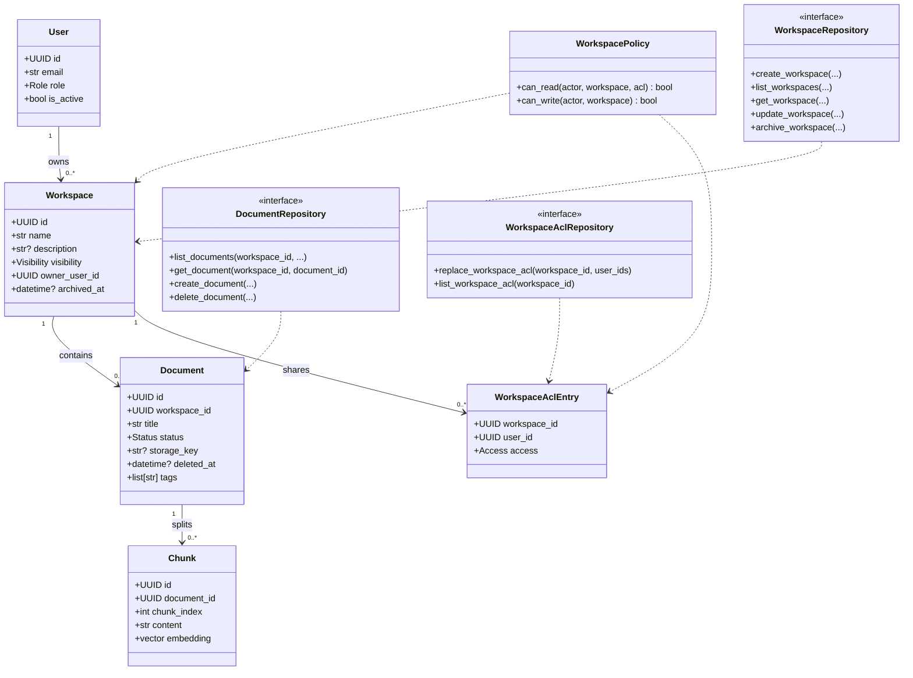

# Informe de Sistemas — RAG Corp (Definitivo)

**Autor:** Santiago Scacciaferro  
**Fecha:** 2026-01-21 (America/Argentina/Cordoba)  
**Repo:** `rag-corp`  
**Fuente de verdad (producto, Especificación Base):** `.github/informe_de_producto_y_analisis_rag_corp_v4_workspaces_secciones_gobernanza_y_roadmap.md` + `.github/rag_corp_informe_de_analisis_y_especificacion_v4_secciones.md`  
**Fuente de verdad (arquitectura / decisiones):** `docs/architecture/overview.md` + `docs/architecture/adr/ADR-001..ADR-007`  
**Fuente de verdad (contratos):** `shared/contracts/openapi.json` + `docs/reference/api/http-api.md`  
**Fuente de verdad (datos):** `apps/backend/alembic/` + `docs/reference/data/postgres-schema.md`

---

## 1. Introducción y Alcance (El “Contrato”)

### 1.1 Definición del problema (AS-IS)

En su baseline actual, RAG Corp ya resuelve la parte “técnica pesada” de un sistema RAG:

- UI Next.js tipo “Sources” (estilo NotebookLM) para documentos y Q&A.
- Backend FastAPI con **Clean Architecture** (Domain / Application / Infrastructure).
- PostgreSQL + pgvector para chunks y embeddings.
- Ingesta y upload (PDF/DOCX) con pipeline **asíncrono** (Redis/RQ/worker).
- Dual auth (JWT para usuarios + API keys con RBAC para integraciones).
- Observabilidad y CI con E2E.

**Pain points (negocio/seguridad):**

- No existía (históricamente) el concepto de **Workspace** (\"Sección\" solo UI) como unidad de organización y gobernanza.
- Sin Workspaces, el conocimiento quedaba “global”, lo que:
  - rompe el modelo mental empresarial (áreas/periodos),
  - dificulta ownership (“no tocar lo de otro”),
  - y eleva el riesgo de mezcla de fuentes (fuga de información).
- En producción, hay requisitos explícitos de hardening (fail-fast, CSP, métricas protegidas, etc.) que deben quedar auditables.

### 1.2 Objetivos del proyecto (SMART)

**Objetivo general (visión):**
Construir una “**NotebookLM empresarial**” donde el conocimiento se gestione por **Workspaces** (\"Sección\" solo UI) con permisos claros (owner/admin vs viewers), consultas siempre acotadas a un workspace, y trazabilidad operable (auditoría + observabilidad + CI).

**Objetivos específicos (medibles):**

1. Implementar Workspaces completos (CRUD + publish/share + archive) con visibilidad `PRIVATE | ORG_READ | SHARED`.
2. Garantizar **scoping total** por workspace: documentos, chunks, retrieval y ask/chat.
3. Implementar y centralizar políticas de acceso (Domain) con matriz exhaustiva de tests.
4. Cumplir RNF de seguridad en prod: **fail-fast** para defaults inseguros, cookies secure, CSP sin `unsafe-inline` (o nonces/hashes), `/metrics` protegido.
5. CI con `e2e-full` cubriendo flujo end-to-end (admin): `login → create workspace → upload → READY → ask scoped`.

### 1.3 Alcance (Scope)

**In-Scope:**

- Workspaces (técnicamente “Workspace”; “Sección” solo copy de UI).
- Gobernanza: owner/admin write; viewers read+chat.
- Visibilidad: `PRIVATE`, `ORG_READ`, `SHARED` (+ `workspace_acl`).
- Documentos dentro de workspace: upload/list/get/delete/reprocess (scoped) + estados `PENDING/PROCESSING/READY/FAILED`.
- RAG acotado: ask/query/stream siempre con `workspace_id` y filtrado en retrieval.
- Auditoría de eventos críticos (auth/workspace/doc) con trazabilidad por workspace.
- Observabilidad (health/ready/metrics/logs) para API y worker.
- Contratos OpenAPI + cliente generado (Orval) como anti-drift FE/BE.

**Out-of-Scope (por ahora):**

- Multi-tenant por empresa.
- SSO/LDAP.
- OCR avanzado obligatorio para PDFs escaneados.
- Agente de escritorio / sincronización automática de carpetas locales.
- Workflows complejos de aprobación/firma.

### 1.4 Supuestos y restricciones

**Supuestos:**

- Organización única (single-tenant) con usuarios `admin/employee`.
- Embeddings y LLM se proveen por Google GenAI (con fakes habilitables para tests/desarrollo).
- Los binarios pueden vivir en S3-compatible (MinIO on-prem o S3 cloud).

**Restricciones:**

- El sistema debe mantenerse compatible con operación local vía Docker Compose.
- Debe respetarse Clean Architecture + ports/adapters (no “atajos” acoplados a FastAPI/DB en Domain).
- Errores HTTP deben seguir RFC7807 (`application/problem+json`).

### 1.5 Glosario mínimo

- **Workspace (\"Sección\" solo UI):** contenedor lógico de documentos y chat; unidad de permisos y scoping.
- **Owner:** usuario asignado al workspace (provisionado por admin); controla escritura/borrado/reprocess (junto a admin).
- **Visibility:** `PRIVATE | ORG_READ | SHARED`.
- **ACL:** lista explícita (`workspace_acl`) para visibilidad `SHARED`.
- **RAG:** retrieval de chunks + LLM para responder con fuentes.
- **Chunk:** fragmento de documento con embedding vectorial.
- **RFC7807:** formato estándar de error JSON.

---

## 2. Stack Tecnológico y Arquitectura (Los Cimientos)

### 2.1 Arquitectura de software

**Patrón:** Clean Architecture (capas Domain / Application / Infrastructure + API).  
**Justificación:**

- Aísla reglas de negocio (política de acceso, invariantes de workspace) de frameworks.
- Permite reemplazar proveedores (LLM, embeddings, storage, queue) con adapters.
- Facilita tests unitarios por capa y evita drift (contratos explícitos).

**Límites (regla de dependencia):**

- Domain no depende de Application/Infrastructure/API.
- Application depende de Domain, pero no de Infrastructure.
- Infrastructure implementa ports definidos por Domain/Application.
- API usa DI (container) y orquesta casos de uso.

### 2.2 Componentes principales

- **Frontend (Next.js)**: navegación, selector de workspace, UI Sources/Chat, panel admin.
- **Backend API (FastAPI)**: auth, workspaces, documents, ask/query/stream, métricas.
- **Worker (RQ)**: procesamiento asíncrono de documentos (extract → chunk → embed → persist).
- **PostgreSQL + pgvector**: almacenamiento relacional + vector store.
- **Redis**: cola RQ (y opcional cache).
- **S3/MinIO**: almacenamiento de binarios.
- **Observabilidad**: Prometheus/Grafana (perfil opcional).

### 2.3 Diagrama de despliegue (Deployment)

```mermaid
flowchart LR
  subgraph Client[Clientes]
    B[Browser (Next.js UI)]
    C[CI/Integraciones (API Key)]
  end

  subgraph Docker[Docker Compose / Infra]
    W[web :3000\n(profile e2e)]
    API[rag-api :8000]
    WK[worker :8001 (readyz)]
    R[(redis :6379\n(profile worker/full))]
    DB[(postgres+pgvector :5432)]
    S3[(minio :9000\nconsole :9001\n(profile storage/full))]
    P[prometheus :9090\n(profile observability/full)]
    G[grafana :3001->3000\n(profile observability/full)]
  end

  B -->|HTTP| W
  W -->|HTTP /api/* rewrites| API
  C -->|HTTPS| API

  API -->|SQL| DB
  API -->|enqueue jobs| R
  API -->|put/get object| S3

  WK -->|SQL| DB
  WK -->|dequeue jobs| R
  WK -->|get object| S3

  API -->|/metrics| P
  WK -->|/metrics (si aplica)| P
  P --> G
```

### 2.4 Stack tecnológico (versiones)

**Frontend:**

- Next.js `16.1.1`
- React `19.2.3`
- TypeScript `^5`
- Tailwind `^4`

**Backend:**

- Python `3.11` (target)
- FastAPI `0.128.0`
- Uvicorn `0.40.0`
- SQLAlchemy `>=2.0`
- Alembic `>=1.13`
- psycopg `3.3.2`

**Datos:**

- PostgreSQL `16`
- pgvector `0.8.1` (imagen compose)

**IA:**

- google-genai `1.57.0`
- Embeddings: `text-embedding-004` (768D)

**Queue/Cache:**

- Redis `7-alpine`
- RQ `>=1.16.0`

**Observabilidad (opcional):**

- Prometheus `v2.47.0`
- Grafana `10.2.0`

### 2.5 Decisiones de arquitectura relevantes (ADRs)

- **ADR-001:** Clean Architecture como guía.
- **ADR-002:** Postgres + pgvector como vector store.
- **ADR-003:** Google Gemini/GenAI como provider.
- **ADR-004:** Naming: “Workspace” técnico; “Sección” UI-only.
- **ADR-005:** Unicidad: `unique(owner_user_id, name)`; 409 en conflicto.
- **ADR-006:** Archive/soft-delete: `archived_at` en workspaces; docs soft-delete; excluidos por defecto.
- **ADR-007:** Legacy endpoints: nested es canónico; legacy sobrevive temporalmente pero requiere `workspace_id` explícito (sin “workspace implícito”).

---

## 3. Modelo de Datos (El Corazón)

### 3.1 DER lógico (conceptual)



### 3.2 Modelo físico (tablas, PK/FK)

**Tablas núcleo:**

- `users(id PK)`
- `workspaces(id PK, owner_user_id FK users.id)`
- `workspace_acl(workspace_id FK workspaces.id, user_id FK users.id, UNIQUE(workspace_id,user_id))`
- `documents(id PK, workspace_id FK workspaces.id, uploaded_by_user_id FK users.id)`
- `chunks(id PK, document_id FK documents.id)`
- `audit_events(id PK)` (+ metadata)

### 3.3 Diccionario de datos (resumen)

> Referencia completa: `docs/reference/data/postgres-schema.md`

**users**

- `email (TEXT, UNIQUE, NOT NULL)`: identificador de login.
- `role (TEXT, NOT NULL)`: `admin|employee`.
- `is_active (BOOLEAN)`: soft-disable.

**workspaces**

- `name (TEXT, NOT NULL)`: nombre visible.
- `visibility (TEXT, NOT NULL, DEFAULT PRIVATE)`: `PRIVATE|ORG_READ|SHARED`.
- `owner_user_id (UUID, NOT NULL)`: dueño.
- `archived_at (TIMESTAMPTZ, NULL)`: archivado.
- `UNIQUE(owner_user_id, name)`.

**workspace_acl**

- `workspace_id (UUID, NOT NULL)`: referencia.
- `user_id (UUID, NOT NULL)`: usuario invitado.
- `access (TEXT, DEFAULT READ)`: por ahora solo READ.

**documents**

- `workspace_id (UUID, NOT NULL)`: scoping obligatorio.
- `status (TEXT)`: `PENDING|PROCESSING|READY|FAILED`.
- `storage_key (TEXT)`: ubicación binario en S3/MinIO.
- `tags (TEXT[])`: filtros.
- `deleted_at (TIMESTAMPTZ)`: soft delete.

**chunks**

- `embedding vector(768)`: vector para búsqueda.
- `content TEXT`: texto chunk.

### 3.4 Índices y performance

Índices recomendados/clave:

- `ix_documents_workspace_id` (scoping).
- Índices por `workspaces(visibility, archived_at)`.
- Índices por `workspace_acl(workspace_id)` y `workspace_acl(user_id)`.
- Índices por `chunks(embedding)` (pgvector) y `chunks(document_id)`.

### 3.5 Estrategia legacy / backfill

- Se define un workspace “**Legacy**” para backfillear documentos pre-workspace.
- La migración debe:
  - asegurar que exista al menos un admin o usuario inicial,
  - crear/reusar Legacy,
  - asignar `documents.workspace_id` y luego hacerlo NOT NULL.

---

## 4. Requerimientos (La Ley)

### 4.1 Matriz de Requerimientos Funcionales (RF)

> Fuente base: `.github/informe_de_producto_y_analisis_rag_corp_v4_workspaces_secciones_gobernanza_y_roadmap.md` + `.github/rag_corp_informe_de_analisis_y_especificacion_v4_secciones.md`.  
> Priorización MoSCoW enfocada en el alcance actual.

| ID    | Nombre               | Descripción                                        | Prioridad | Criterios de aceptación (DoD del requisito)                                                              |
| ----- | -------------------- | -------------------------------------------------- | --------- | -------------------------------------------------------------------------------------------------------- |
| RF-A1 | Auth JWT             | Login/logout/me con JWT.                           | Must      | Login correcto crea sesión; credenciales inválidas → 401 RFC7807; `/auth/me` devuelve usuario.           |
| RF-A2 | Cookies httpOnly     | UI usa cookies httpOnly para auth.                 | Must      | Cookie httpOnly; logout invalida cookie; no requiere almacenar JWT en localStorage.                      |
| RF-A3 | API keys + RBAC      | API keys para CI/integraciones con RBAC.           | Must      | Endpoint protegido exige permisos; sin RBAC usa fallback de scopes legacy; actor service queda auditado. |
| RF-B1 | CRUD Workspaces      | Crear/listar/ver/editar/archivar workspaces.       | Must      | `PRIVATE` por default; unicidad `owner+name`; archivados no aparecen por defecto.                        |
| RF-B2 | Visibilidad + Share  | `ORG_READ` y `SHARED` (ACL).                       | Must      | ORG_READ visible a empleados; SHARED visible solo en ACL; cambios generan auditoría.                     |
| RF-B3 | Permisos owner/admin | Owner/admin write; viewers read+chat.              | Must      | Viewer no puede upload/delete/reprocess; 403 RFC7807; admin override funciona.                           |
| RF-C1 | Upload a workspace   | Upload PDF/DOCX asociado a workspace.              | Must      | Upload crea doc PENDING en workspace; valida MIME/size; encola job.                                      |
| RF-C2 | Estados documento    | PENDING/PROCESSING/READY/FAILED.                   | Must      | Worker transiciona; FAILED guarda error_message; UI muestra estado.                                      |
| RF-C3 | CRUD docs scoped     | list/get/delete/reprocess filtrados por workspace. | Must      | Un usuario sin acceso al workspace no puede ver docs ni operar.                                          |
| RF-C4 | Filtros              | tags + búsqueda + paginación.                      | Should    | Listado filtra por tag/status/q; paginación estable y testeada.                                          |
| RF-D1 | Ask/query scoped     | ask/query/stream reciben workspace_id.             | Must      | Sin workspace_id → 400; sin acceso → 403; no hay fuentes cruzadas.                                       |
| RF-D2 | Retrieval scoped     | retrieval solo del workspace.                      | Must      | Test cross-workspace: WS1 nunca devuelve chunks de WS2.                                                  |
| RF-E1 | Auditoría            | eventos críticos (auth/workspace/doc).             | Must      | Se registran acciones con actor y target; workspace_id en metadata/columna cuando aplica.                |
| RF-E2 | Consulta auditoría   | admin puede consultar auditoría.                   | Should    | Endpoint admin-only permite filtrar por workspace/actor/acción y paginar.                                |
| RF-F1 | UI por workspace     | Sources/Chat por workspace.                        | Must      | Existe `/workspaces`; selector; navegación al workspace y sus docs/chat.                                 |
| RF-F2 | Selector + filtros   | selector global + filtros de sources.              | Should    | Selector persistente; filtros funcionan; estados y permisos visibles.                                    |
| RF-F3 | UI permission-aware  | acciones visibles solo si corresponde.             | Must      | Owner/admin ven upload/delete/reprocess; viewer no ve acciones o quedan disabled.                        |

### 4.2 Matriz de Requerimientos No Funcionales (RNF) — ISO/IEC 25010

| ID         | Categoría (ISO 25010)   | Requisito                                                 | Métrica / Criterio de aceptación                                                              |
| ---------- | ----------------------- | --------------------------------------------------------- | --------------------------------------------------------------------------------------------- |
| RNF-SEC1   | Security                | JWT_SECRET obligatorio en prod (no default).              | En `ENV=prod`, si secret default/vacío → proceso falla al arrancar (fail-fast).               |
| RNF-SEC2   | Security                | Si auth queda deshabilitada en prod → fail-fast.          | `ENV=prod` + auth off → abort startup.                                                        |
| RNF-SEC3   | Security                | Cookies secure en prod.                                   | En prod: `Secure` activo; `SameSite` definido; httpOnly.                                      |
| RNF-SEC4   | Security                | CSP sin unsafe-inline (o con nonces/hashes).              | Header CSP cumple política definida; test smoke valida header.                                |
| RNF-SEC5   | Security                | API key no como mecanismo humano en prod.                 | UI no depende de API key persistida; documentación advierte; CI/E2E pueden usar service keys. |
| RNF-SEC6   | Security                | /metrics protegido en prod.                               | Sin auth → 401/403; con rol/permiso → 200.                                                    |
| RNF-PERF1  | Performance efficiency  | Pipeline asíncrono.                                       | Upload responde rápido (202) y delega extracción/embeddings al worker.                        |
| RNF-PERF2  | Performance efficiency  | Límites de upload.                                        | 413 al exceder; 415 mime inválido; valores configurables.                                     |
| RNF-OPS1   | Reliability/Operability | /healthz y /readyz en API y worker.                       | health/ready responden; CI smoke verifica.                                                    |
| RNF-OPS2   | Operability             | Métricas Prometheus (API + worker).                       | Métricas exportadas; dashboards opcionales.                                                   |
| RNF-OPS3   | Operability             | Runbooks y troubleshooting.                               | Existe `docs/runbook/*` actualizado con comandos reproducibles.                               |
| RNF-MAINT1 | Maintainability         | Respetar capas Clean Architecture.                        | Revisión + tests: Domain no importa FastAPI/SQLAlchemy.                                       |
| RNF-MAINT2 | Maintainability         | ports/adapters para infra (LLM/embeddings/storage/queue). | Cambiar provider no rompe casos de uso; interfaces estables.                                  |
| RNF-MAINT3 | Maintainability         | tests unit + e2e-full.                                    | Suite verde: unit + e2e + e2e-full.                                                           |

### 4.3 Reglas de negocio (Business Rules)

| ID    | Regla                                                                                                                                 |
| ----- | ------------------------------------------------------------------------------------------------------------------------------------- |
| RB-01 | Todo Workspace tiene `owner_user_id` (ownership).                                                                                     |
| RB-02 | Visibilidad: `PRIVATE` (owner/admin), `ORG_READ` (todos leen + chat), `SHARED` (ACL explícita).                                       |
| RB-03 | Escritura (upload/delete/reprocess) solo owner/admin.                                                                                 |
| RB-04 | Admin override total (puede operar en workspaces ajenos).                                                                             |
| RB-05 | Contexto explícito: toda operación de documentos y RAG es scoped por `workspace_id`.                                                  |
| RB-06 | Archive/soft-delete: workspace archivado se excluye por defecto; docs asociados se soft-deletean o quedan inaccesibles según ADR-006. |
| RB-07 | Unicidad: `unique(owner_user_id, name)`; colisión → 409.                                                                              |
| RB-08 | Provisionamiento de workspaces es admin-only (ADR-009).                                                                               |

### 4.4 Trazabilidad (RF ↔ UC ↔ Endpoints ↔ Tests)

| RF          | UC principales     | Endpoints canónicos              | Tests                                   |
| ----------- | ------------------ | -------------------------------- | --------------------------------------- |
| RF-B1/B2/B3 | UC-02..UC-07/UC-11 | `/v1/workspaces*`                | unit: policy/use_cases; e2e: workspaces |
| RF-C1..C3   | UC-05/UC-06/UC-12  | `/v1/workspaces/{id}/documents*` | unit: doc use cases; e2e: upload scoped |
| RF-D1/D2    | UC-07              | `/v1/workspaces/{id}/ask*`       | unit: answer_query; e2e: ask scoped     |
| RF-E1/E2    | UC transversales   | `/v1/admin/audit`                | unit: audit repo; integration smoke     |
| RF-A\*      | UC-01/UC-09        | `/auth/*`                        | unit: auth; e2e: login                  |

---

## 5. Modelo Funcional (La Dinámica)

### 5.1 Diagrama de casos de uso (alto nivel)

```mermaid
flowchart TB
  Admin((Admin))
  Emp((Employee))
  Worker((Worker))
  Service((Service API Key))

  UC1[UC-01 Login/Me/Logout]
  UC2[UC-02 Crear Workspace]
  UC3[UC-03 Publicar ORG_READ]
  UC4[UC-04 Compartir SHARED]
  UC10[UC-10 Listar Workspaces visibles]
  UC11[UC-11 Archivar/Unarchivar Workspace]

  UC5[UC-05 Upload documento]
  UC6[UC-06 Procesar documento (async)]
  UC12[UC-12 List/Get/Delete/Reprocess docs]

  UC7[UC-07 Ask/Chat scoped]

  UC9[UC-09 Admin: gestión usuarios]
  UC8[UC-08 Auditoría]

  Emp --> UC1
  Emp --> UC2
  Emp --> UC10
  Emp --> UC7
  Emp --> UC5

  Admin --> UC1
  Admin --> UC2
  Admin --> UC3
  Admin --> UC4
  Admin --> UC9
  Admin --> UC11
  Admin --> UC12
  Admin --> UC8

  Service --> UC5
  Service --> UC7

  Worker --> UC6
  UC5 --> UC6
```

### 5.2 Especificación de casos de uso (plantilla + principales)

> Formato resumido: precondiciones / flujo / alternativos / postcondiciones / aceptación.

#### UC-01 — Login (Employee/Admin)

- **Pre:** usuario activo.
- **Flujo:** enviar credenciales → validar password (Argon2) → emitir JWT cookie → sesión activa.
- **Alternativos:** credenciales inválidas → 401 RFC7807.
- **Post:** actor autenticado.

#### UC-02 — Crear Workspace (Admin)

- **Pre:** autenticado con rol admin.
- **Flujo:** enviar name/description (+ opcional `owner_user_id`) → validar → crear con `visibility=PRIVATE` y `owner_user_id` asignado por admin → auditar `workspace.create`.
- **Alternativos:** name inválido → 400; conflicto unique → 409; no admin → 403.
- **Post:** workspace creado.

#### UC-03 — Publicar a ORG_READ (Owner/Admin)

- **Pre:** workspace existe y no archivado.
- **Flujo:** cambiar visibility→ORG_READ → auditar `workspace.publish`.
- **Alternativos:** no owner/admin → 403; workspace archivado → 404/409 según regla.
- **Post:** todos los employees pueden ver + chatear.

#### UC-04 — Compartir (SHARED) (Owner/Admin)

- **Pre:** workspace existe.
- **Flujo:** recibir lista de user_ids → validar → reemplazar ACL → set visibility=SHARED → auditar `workspace.share`.
- **Alternativos:** user_ids inválidos → 400; no owner/admin → 403.
- **Post:** solo usuarios listados pueden ver/chatear.

#### UC-05 — Upload documento (Owner/Admin)

- **Pre:** workspace existe; actor con permiso write.
- **Flujo:** upload → validar MIME/size → guardar binario (S3) → crear doc `PENDING` → encolar job → responder 202.
- **Alternativos:** 403 sin permiso; 415 mime; 413 size; 503 storage.
- **Post:** doc PENDING.

#### UC-06 — Procesar documento (Worker)

- **Pre:** doc PENDING.
- **Flujo:** set PROCESSING → descargar binario → extraer texto → chunk+embed → persist chunks → set READY.
- **Alternativos:** error → FAILED con error_message; idempotencia si ya READY/PROCESSING.
- **Post:** READY/FAILED.

#### UC-07 — Ask/Chat scoped (Employee/Admin)

- **Pre:** acceso al workspace; docs READY opcionales.
- **Flujo:** enviar query con workspace_id → retrieval filtrado por workspace → LLM responde → retorna answer + sources.
- **Alternativos:** sin acceso → 403; sin docs → respuesta válida sin fuentes.
- **Post:** respuesta sin contaminación cross-workspace.

#### UC-09 — Admin: gestión usuarios (Admin)

- **Pre:** rol admin.
- **Flujo:** listar/crear/desactivar/reset-password → auditar `admin.user.*`.
- **Alternativos:** no admin → 403.

#### UC-11 — Archivar workspace (Owner/Admin)

- **Pre:** workspace existe.
- **Flujo:** set `archived_at` → excluir de listados default → auditar `workspace.archive`.
- **Post:** workspace no aparece en paths “activos”.

### 5.3 Diagramas de actividades (swimlanes)

#### Upload asíncrono

```mermaid
flowchart LR
  subgraph U[Usuario/Cliente]
    A[Selecciona archivo + workspace]
    B[POST upload]
  end

  subgraph API[Backend API]
    C[Valida permisos + MIME + size]
    D[Guarda binario en S3]
    E[Crea Document(PENDING)]
    F[Encola job]
    G[202 Accepted]
  end

  subgraph W[Worker]
    H[Consume job]
    I[PROCESSING]
    J[Extract texto]
    K[Chunk + Embed]
    L[Persist chunks]
    M[READY/FAILED]
  end

  A --> B --> C --> D --> E --> F --> G
  F --> H --> I --> J --> K --> L --> M
```

#### Ask (RAG) scoped

```mermaid
flowchart LR
  subgraph U[Usuario/Cliente]
    A[Escribe pregunta en workspace]
    B[POST /ask (workspace_id)]
  end

  subgraph API[Backend API]
    C[Valida acceso al workspace]
    D[Embed query]
    E[Vector search filtrado por workspace]
    F[Construye contexto]
    G[LLM answer]
    H[Retorna answer + sources]
  end

  A --> B --> C --> D --> E --> F --> G --> H
```

### 5.4 Máquina de estados (Document)



---

## 6. Modelo Estructural (El Código)

### 6.1 Diagrama de clases (núcleo Domain + políticas)



### 6.2 Patrones de diseño usados

- **Repository**: repositorios (Postgres) para persistencia.
- **Ports & Adapters**: `EmbeddingService`, `LLMService`, `FileStoragePort`, `Queue`.
- **Policy (Domain Service)**: `WorkspacePolicy` centraliza autorización.
- **Dependency Injection**: `container.py` resuelve wiring.
- **Template/Strategy**: prompts versionados y estrategias de retrieval (MMR opcional).

### 6.3 Reglas de calidad

- SOLID + separación de responsabilidades.
- Inputs/Outputs tipados en Application.
- Errores consistentes (RFC7807) desde API.
- Contratos OpenAPI exportados y consumidos por FE.

---

## 7. Diseño de Interfaz (La Experiencia)

### 7.1 Mapa de navegación (Sitemap)

- `/login`
- `/workspaces`
  - Crear workspace (solo admin)
  - Listar workspaces visibles
- `/workspaces/{id}` (Sources)
  - Listar documentos (scoped)
  - Upload (solo owner/admin)
  - Reprocess/Delete (solo owner/admin)
  - Filtros (status/tag/q)
- `/workspaces/{id}/chat`
  - Ask / Stream scoped
- `/admin/users` (solo admin)

### 7.2 User flows (texto)

**Employee (owner):** login → acceder workspace asignado → upload docs → esperar READY → chat → publish/share (opcional) → auditoría.

**Employee (viewer):** login → ver ORG_READ/SHARED → chat → ver sources → (sin acciones de escritura).

**Admin:** login → admin/users → gestionar usuarios → ver/operar en cualquier workspace → auditoría.

### 7.3 Wireframes (baja fidelidad, ASCII)

**/workspaces**

```
+---------------------------------------------------+
| Workspaces  [+ Nuevo]                             |
| [Buscar...]                                       |
|---------------------------------------------------|
| (chip) PRIVATE/ORG_READ/SHARED  (owner?)           |
|  - Contaduría — Enero   [Abrir]   [Archive]        |
|  - Ventas — Q1          [Abrir]                    |
+---------------------------------------------------+
```

**/workspaces/{id} (Sources)**

```
+---------------------------------------------------+
| < Selector workspace >    [Upload]* [Share]*       |
| Filtros: [status] [tag] [q...]                    |
|---------------------------------------------------|
| Doc A   READY   [Ver] [Reprocess]* [Delete]*       |
| Doc B   FAILED  [Ver error] [Reprocess]*           |
+---------------------------------------------------+
* solo owner/admin
```

**/workspaces/{id}/chat**

```
+---------------------------------------------------+
| Workspace: Contaduría — Enero                      |
|---------------------------------------------------|
| Chat                                               |
| Q: ...                                              |
| A: ...                                              |
| Sources: [DocA#3] [DocA#5]                          |
+---------------------------------------------------+
```

---

## 8. Análisis de Riesgos (La Previsión)

### 8.1 Matriz de riesgos

| Riesgo                                | Prob. | Impacto | Mitigación (preventiva)                                        | Contingencia (reactiva)                                               |
| ------------------------------------- | ----- | ------- | -------------------------------------------------------------- | --------------------------------------------------------------------- |
| Mezcla de fuentes entre workspaces    | Media | Crítico | Scoping obligatorio en DB + repos + use cases + tests cross-WS | Hotfix: bloquear legacy endpoints hasta pasar tests; rollback release |
| Defaults inseguros en prod            | Media | Crítico | Fail-fast en startup + checklist deploy                        | Rotación de secretos + invalidate sesiones                            |
| Cambios en SDK/proveedor GenAI        | Media | Alto    | Adapter + contract tests + fakes                               | Switch provider vía adapter; feature flag                             |
| Costos/latencia por embeddings/LLM    | Media | Alto    | Cache embeddings + límites + observabilidad                    | Throttling + degradación (top_k menor)                                |
| Archiving/borrado inconsistente       | Baja  | Alto    | ADR-006 + tests de archivo + queries excluyen archivados       | Script de reparación / reindex                                        |
| Saturación por uploads grandes        | Media | Medio   | MAX_UPLOAD_BYTES + cola + backpressure                         | Pausar uploads; aumentar workers                                      |
| Drift FE/BE (contratos)               | Media | Alto    | OpenAPI export + Orval + CI gates                              | Bloquear merge si contratos no coinciden                              |
| Pérdida de historial chat (in-memory) | Alta  | Medio   | (Post-100%) persistencia en Redis/Postgres                     | Aviso en UI; TTL; migración gradual                                   |

---

## 9. CRC + Mapa de Docs

### 9.1 CRC (Documentación)

**Componente:** `docs/`  
**Responsibilities:**

1. Ser la fuente de verdad documental del sistema (contrato, arquitectura, runbooks).
2. Mantener coherencia con `shared/contracts/openapi.json` y el código.  
   **Collaborators:** `shared/contracts/openapi.json`, `apps/backend/app/`, `.github/workflows/ci.yml`  
   **Constraints:** no inventar endpoints; todo path debe existir en OpenAPI.

### 9.2 Docs Map (Source of Truth)

| Tema         | Documento canónico                             | Secundarios                      |
| ------------ | ---------------------------------------------- | -------------------------------- | --- |
| Contrato API | `shared/contracts/openapi.json`                | `docs/reference/api/http-api.md` |
| Sistema      | `docs/project/informe_de_sistemas_rag_corp.md` | `docs/project/release-notes.md`  |     |
| Arquitectura | `docs/architecture/overview.md`                | `docs/architecture/adr/*`        |
| Datos        | `docs/reference/data/postgres-schema.md`       | `apps/backend/alembic/`          |
| Operación    | `docs/runbook/*`                               | `infra/*`                        |
| Testing/CI   | `docs/quality/testing.md`                      | `.github/workflows/ci.yml`       |

---

## Apéndice A — Criterio de Completitud (Definition of Done global)

El proyecto se considera **100%** cuando se cumplen todos:

1. Workspaces completos (CRUD + visibilidad + share).
2. Documentos y consultas 100% scoped por workspace.
3. Permisos: owner/admin write; viewers read+chat.
4. UI: Workspaces + Sources/Chat por workspace.
5. Auditoría por workspace.
6. Hardening prod: secrets/config, métricas protegidas.
7. CI `e2e-full` (admin): login → crear workspace → upload → READY → chat.

---

## Apéndice B — Referencias internas (docs)

- Producto: `.github/informe_de_producto_y_analisis_rag_corp_v4_workspaces_secciones_gobernanza_y_roadmap.md`
- Análisis: `.github/rag_corp_informe_de_analisis_y_especificacion_v4_secciones.md`
- Arquitectura: `docs/architecture/overview.md`
- ADRs: `docs/architecture/adr/ADR-001..ADR-007`
- API: `docs/reference/api/http-api.md`, `shared/contracts/openapi.json`
- Datos: `docs/reference/data/postgres-schema.md`, `apps/backend/alembic/`
- Runbooks: `docs/runbook/*`
- Calidad: `docs/quality/testing.md`
