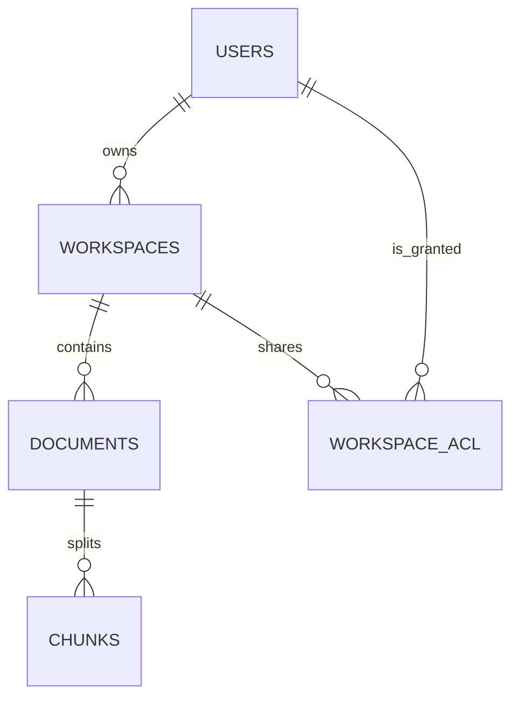
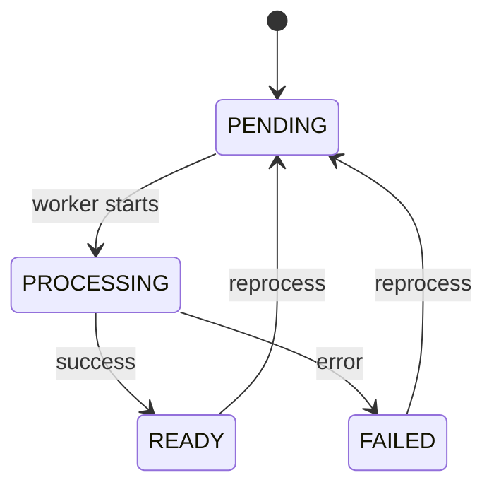

# Reescritura completa (v6)

Este documento contiene **dos archivos completos** listos para copiar/pegar:

1. `.github/copilot-instructions.md`
2. `docs/project/informe_de_sistemas_rag_corp.md`

---

## 1) `.github/copilot-instructions.md`

```md
# <!--

# TARJETA CRC (Class / Responsibilities / Collaborators)

Class (Artefacto): .github/copilot-instructions.md (Instrucciones v6)

Responsibilities (Responsabilidades):

- Evitar drift: definir fuentes de verdad y el orden de verificación.
- Fijar reglas de calidad Pro‑Senior (capas, tipado, errores, seguridad, observabilidad).
- Guiar el modo de trabajo: cambios pequeños, verificables y sin alucinaciones.

Collaborators (Colaboradores):

- docs/: documentación canónica (especialmente docs/project + docs/reference + docs/architecture).
- shared/contracts/openapi.json + cliente generado.
- # apps/backend + apps/frontend + compose.yaml + workflows.
  -->

# Instrucciones del proyecto — RAG Corp (v6)

## Estado / Versión

- La versión vigente del proyecto/documentación es **v6**.
- Cualquier referencia a “v4” debe marcarse como **HISTORICAL** (origen/especificación pasada).

---

## Source of Truth (anti-drift)

Antes de afirmar algo “como cierto”, verificar **en este orden**:

1. **Sistema v6 (contrato funcional + alcance + invariantes)**
   - `docs/project/informe_de_sistemas_rag_corp.md`
   - Portales de navegación (sin duplicar detalle): `docs/README.md` + `docs/index/*.md`

2. **Contratos (anti-drift FE/BE)**
   - **OpenAPI canónico:** `shared/contracts/openapi.json`
   - **Cliente generado (Orval):** `shared/contracts/src/generated.ts`
   - Nota: `docs/reference/api/http-api.md` es guía transversal; si contradice al OpenAPI, **manda OpenAPI**.

3. **Datos y migraciones (la DB manda)**
   - Migraciones: `apps/backend/alembic/versions/*`
   - Esquema canónico: `docs/reference/data/postgres-schema.md`
   - Políticas: `docs/reference/data/migrations-policy.md`
   - Stubs **OBSOLETO** (solo redirección): `docs/data/*`

4. **Runtime real (lo que corre en serio)**
   - Compose y perfiles: `compose.yaml` + `.env.example`
   - Backend runtime:
     - Entrypoint ASGI: `apps/backend/app/main.py`
     - Router raíz / prefijos: `apps/backend/app/api/main.py` + `apps/backend/app/api/versioning.py`
     - HTTP adapters: `apps/backend/app/interfaces/api/http/router.py` + `apps/backend/app/interfaces/api/http/routers/*`
     - DI/wiring: `apps/backend/app/container.py`
   - Frontend runtime:
     - Next config: `apps/frontend/next.config.mjs`
   - CI/CD:
     - Workflows: `.github/workflows/*.yml`

5. **Decisiones (ADRs)**
   - Vista: `docs/architecture/overview.md`
   - ADRs: `docs/architecture/adr/*.md`

---

## Contrato de Calidad Pro‑Senior (obligatorio)

### Estilo y documentación en código

- Cada archivo nuevo o modificado debe empezar con **Tarjeta CRC** (comentario) indicando:
  - Artefacto, responsabilidades, colaboradores.
- Comentarios y docstrings **en español**.

### Capas (separación estricta)

- **Domain**: puro (sin FastAPI/SQLAlchemy/Redis/SDKs). Define entidades, objetos de valor, policies y puertos.
- **Application**: orquesta casos de uso (inputs/outputs tipados, validación de invariantes).
- **Infrastructure**: implementa puertos (DB/queue/storage/LLM/embeddings). No filtrar errores de vendor: mapearlos a errores propios.
- **Interfaces**: adapta HTTP (schemas/routers) y traduce errores → RFC7807.

### Calidad de diseño

- SOLID / Clean Code: SRP, OCP, ISP, DIP.
- Contratos/DTOs separados (no mezclar schemas HTTP con DTOs de Application).
- Errores tipados (no `Exception` genérico como contrato). Mantener un mapa consistente hacia RFC7807.

### Seguridad, límites y robustez

- Fail-fast en prod: defaults inseguros deben romper startup (ver `apps/backend/app/crosscutting/config.py`).
- Límites explícitos (tamaño upload, paginación, timeouts). Evitar anti‑OOM.
- Permisos: negar por default, permitir por regla explícita.
- `/metrics` protegido según configuración.

### Observabilidad

- Logs estructurados donde aporta valor (actor/target/workspace_id/trace_id si aplica).
- Métricas Prometheus donde ya existe soporte.
- Auditoría best-effort para eventos críticos (no romper la operación por falla de auditoría, salvo que el requisito diga lo contrario).

### Compatibilidad

- Compatibilidad mediante shims/alias **sin mencionar “legacy”** ni versiones internas como “v4/v6”.
- Si hay endpoints alternativos, documentarlos como **DEPRECATED** con plan de retiro.

---

## Veracidad / No alucinaciones

- No inventar features/tests/carpetas/paths. Si no existe en el repo, marcar como **TODO/Planned**.
- Para rutas/endpoints/comandos: verificar en **OpenAPI**, `compose.yaml`, y código real.
- Si no se puede verificar, asumir lo mínimo y declarar la suposición en **1 línea**.

---

## Modo de trabajo (ejecución)

- Cambios **incrementales**: pequeños, revisables y con evidencia.
- Preferir **diff/patch** al editar archivos.
- Si falta una decisión menor, elegir la opción más segura y coherente con el repo.
- Solo pedir aclaración si hay ambigüedad bloqueante, cambio destructivo o riesgo de seguridad.

---

## Naming / Semántica v6 (consistencia)

- “Workspace” es el término técnico (API/DB/código). “Sección” es **solo copy de UI**.
- Visibilidad (si aplica): `PRIVATE | ORG_READ | SHARED` (+ `workspace_acl`).
- Prefijo canónico: `/v1`.
- Alias de compatibilidad: `/api/v1`.
- Endpoints alternativos no-nested: **DEPRECATED** y deben requerir `workspace_id` explícito.

---

## Documentación (reglas)

- Portal raíz: `README.md`.
- Portal docs: `docs/README.md` + `docs/index/*`.
- Arquitectura: `docs/architecture/overview.md` + `docs/architecture/adr/*`.
- API: `shared/contracts/openapi.json` (fuente) + `docs/reference/api/http-api.md` (guía).
- Datos: `docs/reference/data/postgres-schema.md` (fuente) + migraciones en `apps/backend/alembic/`.
- Seguridad: `docs/reference/access-control.md` + `docs/security/*`.
- Operación: `docs/runbook/*` + `compose.yaml` + `.github/workflows/*`.
- Si un cambio impacta docs/contratos/operación, **actualizar en el mismo commit**.
- Si hay docs viejos que contradicen v6, dejarlos como stubs **OBSOLETO** que apunten a la ruta nueva.

---

## Testing / Comandos (mínimo)

- Backend unit: `pnpm test:backend:unit`
- CI local full core: `pnpm stack:core`
- CI e2e: `pnpm e2e`
- Export/regen contratos:
  - `pnpm contracts:export`
  - `pnpm contracts:gen`

---

## Git (flujo v6)

- No crear ramas/PRs por defecto. Trabajar en la rama actual.
- 1 tarea/prompt = 1 commit (salvo que el prompt pida dividir).
- Usar Conventional Commits.
- No hacer push salvo pedido explícito.
```

---

## 2) `docs/project/informe_de_sistemas_rag_corp.md`

````md
# Informe de Sistemas — RAG Corp (Definitivo)

**Autor:** Santiago Scacciaferro  
**Fecha:** 2026-02-03 (America/Argentina/Cordoba)  
**Repo:** `rag-corp`

## Fuente de verdad (anti-drift)

> Regla: si un documento contradice a otro, manda el de **prioridad más alta**.

1. **Sistema v6 (este documento)**: `docs/project/informe_de_sistemas_rag_corp.md`
2. **Contrato API**: `shared/contracts/openapi.json` (+ `shared/contracts/src/generated.ts`)
3. **Datos**: `apps/backend/alembic/versions/*` + `docs/reference/data/postgres-schema.md`
4. **Runtime real**: `compose.yaml`, `.github/workflows/*`, `apps/frontend/next.config.mjs`, `apps/backend/app/main.py` + `apps/backend/app/api/*`
5. **Decisiones**: `docs/architecture/overview.md` + `docs/architecture/adr/*.md`

## Fuentes base (HISTORICAL)

- Producto/Especificación base (origen v4):
  - `.github/informe_de_producto_y_analisis_rag_corp_v4_workspaces_secciones_gobernanza_y_roadmap.md`
  - `.github/rag_corp_informe_de_analisis_y_especificacion_v4_secciones.md`

---

## 1. Introducción y Alcance (El “Contrato”)

### 1.1 Problema (AS-IS)

RAG Corp ya resuelve la parte “técnica pesada” de un sistema RAG:

- UI Next.js tipo “Sources” (estilo NotebookLM) para documentos + Q&A.
- Backend FastAPI con **Clean Architecture** (Domain / Application / Infrastructure + Interfaces).
- PostgreSQL + pgvector para chunks y embeddings.
- Ingesta/upload con pipeline **asíncrono** (Redis/RQ/worker) cuando se activa el perfil.
- Dual auth: JWT para usuarios + API keys con RBAC para integraciones.
- Observabilidad y CI con suites unit/integration/e2e.

**Pain points de negocio/seguridad** (lo que hace “empresa” a un RAG):

- Sin **Workspaces** como unidad real de gobernanza, el conocimiento tiende a quedar “global”.
- Eso rompe el modelo mental empresarial (áreas/periodos), dificulta ownership y aumenta el riesgo de mezcla de fuentes.
- En producción, hay requisitos explícitos de hardening (fail‑fast, métricas protegidas, límites, auditoría) que deben ser verificables.

### 1.2 Objetivo (visión)

Construir una “**NotebookLM empresarial**” donde el conocimiento se gestione por **Workspaces** ("Sección" es solo copy de UI) con:

- permisos claros (admin/owner vs viewers),
- consultas siempre acotadas al workspace,
- trazabilidad operable (auditoría + observabilidad + CI),
- y contratos OpenAPI como anti‑drift FE/BE.

### 1.3 Alcance

**In‑Scope**

- Workspaces: CRUD + publish/share + archive.
- Scoping total por workspace: documentos, chunks, retrieval, ask/chat.
- Permisos: owner/admin write; viewers read+chat.
- Documentos: upload/list/get/delete/reprocess (scoped) + estados `PENDING/PROCESSING/READY/FAILED`.
- Auditoría de eventos críticos (auth/workspace/doc) con metadata utilizable.
- Operación: health/ready/metrics + runbooks.
- Contratos OpenAPI + cliente generado (Orval).

**Out‑of‑Scope (por ahora)**

- Multi‑tenant por empresa.
- SSO/LDAP.
- OCR avanzado obligatorio para PDFs escaneados.
- Agente de escritorio/sync automático de carpetas.
- Workflows complejos de aprobación/firma.

### 1.4 Supuestos y restricciones

**Supuestos**

- Organización única (single‑tenant) con usuarios `admin/employee`.
- LLM y embeddings provistos por Google GenAI, con fakes habilitables en dev/test.
- Binarios en storage S3‑compatible (MinIO on‑prem o S3 cloud).

**Restricciones**

- Operación local reproducible vía Docker Compose.
- Clean Architecture con límites estrictos (Domain puro; Infrastructure implementa puertos; Interfaces adapta HTTP).
- Errores HTTP siguiendo RFC7807 (`application/problem+json`).

### 1.5 Glosario mínimo

- **Workspace ("Sección" solo UI):** contenedor lógico de documentos y chat; unidad de permisos y scoping.
- **Owner:** usuario dueño del workspace; controla escritura (junto a admin).
- **Visibility:** `PRIVATE | ORG_READ | SHARED`.
- **ACL:** lista explícita (`workspace_acl`) para `SHARED`.
- **RAG:** retrieval de chunks + LLM para responder con fuentes.
- **Chunk:** fragmento de documento con embedding vectorial.
- **RFC7807:** estándar de error JSON.

---

## 2. Stack y Arquitectura (Los Cimientos)

### 2.1 Arquitectura de software

**Patrón:** Clean Architecture (Domain / Application / Infrastructure / Interfaces).  
**Evidencia:** `apps/backend/app/README.md` y READMEs hoja por capa.

**Regla de dependencia**

- Domain no depende de Application/Infrastructure/Interfaces.
- Application depende de Domain, no de Infrastructure.
- Infrastructure implementa puertos definidos por Domain.
- Interfaces adapta HTTP y traduce errores a RFC7807.

### 2.2 Componentes principales

- **Frontend (Next.js)**: navegación, selector de workspace, Sources/Chat, panel admin.
- **Backend API (FastAPI)**: auth, workspaces, documents, ask/query/stream, métricas.
- **Worker (RQ)**: procesamiento asíncrono de documentos (extract → chunk → embed → persist).
- **PostgreSQL + pgvector**: almacenamiento relacional + vector store.
- **Redis**: cola RQ (y opcional cache).
- **S3/MinIO**: almacenamiento de binarios.
- **Observabilidad**: Prometheus/Grafana (+ exporter) por perfil.

### 2.3 Diagrama de despliegue (modelo Compose)

```mermaid
flowchart LR
  subgraph Client[Clientes]
    B[Browser (Next.js UI)]
    C[CI/Integraciones (API Key)]
  end

  subgraph Docker[Docker Compose / Infra]
    W[web :3000\n(profile ui/e2e)]
    API[rag-api :8000]
    WK[worker :8001 (readyz)\n(profile worker/rag/full)]
    R[(redis :6379\n(profile worker/rag/full))]
    DB[(postgres+pgvector :5432)]
    S3[(minio :9000\nconsole :9001\n(profile storage/full))]
    P[prometheus :9090\n(profile observability/full)]
    G[grafana :3000\n(profile observability/full)]
    X[postgres-exporter\n(profile observability/full)]
  end

  B -->|HTTP| W
  W -->|HTTP /api/* rewrites| API
  C -->|HTTPS| API

  API -->|SQL| DB
  API -->|enqueue jobs| R
  API -->|put/get object| S3

  WK -->|SQL| DB
  WK -->|dequeue jobs| R
  WK -->|get object| S3

  DB --> X
  API -->|/metrics| P
  WK -->|/metrics (si aplica)| P
  X --> P
  P --> G
```
````

### 2.4 Stack tecnológico (evidencia en repo)

**Tooling / monorepo**

- Node: `>=20.11.0` (`package.json`)
- pnpm: `10.x` (`package.json`)
- Turbo: `2.0.0` (`package.json`)

**Frontend** (`apps/frontend/package.json`)

- Next.js `16.1.1`
- React `19.2.3`
- TypeScript `^5`
- Tailwind `^4`

**Backend** (`apps/backend/requirements.txt`)

- Python target `3.11` (CI)
- FastAPI `0.128.0`
- Uvicorn `0.40.0`
- SQLAlchemy `>=2.0`
- Alembic `>=1.13`
- psycopg `3.3.2`

**Datos** (`compose.yaml`)

- PostgreSQL `16` (imagen pg16)
- pgvector (imagen `pgvector/pgvector:0.8.1-pg16-trixie`)

**IA** (`apps/backend/requirements.txt`)

- google-genai `1.57.0`
- Embeddings: `text-embedding-004` (según implementación de servicios)

**Queue/Storage/Observabilidad** (`compose.yaml`)

- Redis `7-alpine`
- RQ `>=1.16.0`
- MinIO (S3-compatible)
- Prometheus + Grafana + postgres-exporter (perfil observability/full)

### 2.5 Decisiones de arquitectura (ADRs)

Referencia: `docs/architecture/adr/*.md`.

- ADR-001: Clean Architecture.
- ADR-002: Postgres + pgvector.
- ADR-003: Google GenAI.
- ADR-004: Naming “Workspace” técnico; “Sección” UI-only.
- ADR-005: Unicidad `unique(owner_user_id, name)` → 409.
- ADR-006: Archive/soft-delete.
- ADR-007: Endpoints alternativos (no-nested) como DEPRECATED.
- ADR-008/009: separación admin/employee.
- ADR-010: política de prompts + hard scoping.

---

## 3. Modelo de Datos (El Corazón)

> Fuente canónica: `docs/reference/data/postgres-schema.md` + `apps/backend/alembic/versions/*`.

### 3.1 DER lógico (conceptual)



### 3.2 Tablas núcleo (resumen)

- `users`
- `workspaces`
- `workspace_acl`
- `documents`
- `chunks`
- `audit_events`

### 3.3 Invariantes clave (de negocio)

- Todo workspace tiene `owner_user_id`.
- Visibilidad: `PRIVATE` (owner/admin), `ORG_READ` (empleados leen + chat), `SHARED` (ACL explícita).
- Escritura: upload/delete/reprocess solo owner/admin.
- Admin override total.
- Scoping explícito: documentos y RAG se acotan por `workspace_id`.
- Archive/soft-delete: archivados excluidos por default; docs soft-delete según ADR.

---

## 4. Contratos HTTP y Flujos (La Dinámica)

> Fuente de verdad del contrato: `shared/contracts/openapi.json`.

### 4.1 Prefijos y versionado

- Prefijo canónico: `/v1`.
- Alias: `/api/v1` (compatibilidad) en `apps/backend/app/api/versioning.py`.

### 4.2 Endpoints operativos

Definidos en `apps/backend/app/api/main.py`:

- `/healthz`
- `/readyz`
- `/metrics` (protegido si `METRICS_REQUIRE_AUTH=1`)

### 4.3 Rutas canónicas vs alternativos

- Canónico (nested): `/v1/workspaces/{workspace_id}/...`
- Alternativos no-nested existen para compatibilidad: `/v1/documents/...`, `/v1/ask`, `/v1/query`.
  - Deben requerir `workspace_id` explícito (en path o body) y se consideran **DEPRECATED**.

### 4.4 Flujos principales

#### Upload asíncrono

```mermaid
flowchart LR
  subgraph U[Usuario/Cliente]
    A[Selecciona archivo + workspace]
    B[POST upload]
  end

  subgraph API[Backend API]
    C[Valida permisos + MIME + size]
    D[Guarda binario en S3]
    E[Crea Document(PENDING)]
    F[Encola job]
    G[202 Accepted]
  end

  subgraph W[Worker]
    H[Consume job]
    I[PROCESSING]
    J[Extract texto]
    K[Chunk + Embed]
    L[Persist chunks]
    M[READY/FAILED]
  end

  A --> B --> C --> D --> E --> F --> G
  F --> H --> I --> J --> K --> L --> M
```

#### Ask (RAG) scoped

```mermaid
flowchart LR
  subgraph U[Usuario/Cliente]
    A[Pregunta en workspace]
    B[POST /ask (workspace_id)]
  end

  subgraph API[Backend API]
    C[Valida acceso al workspace]
    D[Embed query]
    E[Vector search filtrado por workspace]
    F[Construye contexto]
    G[LLM answer]
    H[Retorna answer + sources]
  end

  A --> B --> C --> D --> E --> F --> G --> H
```

#### Máquina de estados (Document)



---

## 5. Seguridad y Control de Acceso

Fuente de verdad: `docs/reference/access-control.md` + `apps/backend/app/identity/*`.

### 5.1 Mecanismos

- **JWT (usuarios)** con roles `admin/employee`.
- **API Keys** (`X-API-Key`) para integraciones.
- **RBAC** para API keys (roles + permisos) configurable.
- **Principal unificado** (USER/SERVICE).

### 5.2 Políticas de acceso a Workspaces

Fuente de verdad: `apps/backend/app/domain/workspace_policy.py`.

Reglas esperadas:

- Read: según `visibility` + ACL + rol.
- Write: owner o admin.
- Admin override.

### 5.3 Hardening y fail-fast

- Validación de seguridad en producción: `apps/backend/app/crosscutting/config.py`.
- Métricas protegidas si aplica (`METRICS_REQUIRE_AUTH=1`).
- Límites y validaciones: ver `docs/reference/limits.md`.

---

## 6. Operación, CI y Runbooks

### 6.1 Docker Compose (perfiles)

Fuente de verdad: `compose.yaml`.

- default: `db + migrate + rag-api`
- ui: agrega `web`
- worker/rag: agrega `redis + worker (+ minio + minio-init según perfil)`
- observability: `prometheus + grafana + postgres-exporter`
- full: suma rag + observability
- e2e: stack para Playwright

### 6.2 CI

Fuente de verdad: `.github/workflows/ci.yml`.

Incluye:

- lint + tests backend
- lint + tests frontend
- contracts-check (export OpenAPI + regen cliente + `git diff --exit-code`)
- e2e / e2e-full con docker compose

### 6.3 Runbooks

- `docs/runbook/*` (local-dev, troubleshooting, etc.)
- Logs/observabilidad: `docs/index/ops.md` y `infra/*`.

---

## 7. Calidad y Testing (DoD técnico)

Fuente de verdad: `docs/quality/*` + `apps/backend/pytest.ini` + `apps/frontend/config/*` + `tests/e2e/*`.

- Unit tests backend: `apps/backend/tests/unit/*` (marker `unit`).
- Integration tests backend: `apps/backend/tests/integration/*`.
- Frontend tests: `apps/frontend/__tests__/*` (Jest).
- E2E: `tests/e2e/tests/*.spec.ts` (Playwright).

Regla anti-drift:

- Si cambia el contrato o rutas, se actualiza OpenAPI y se regenera el cliente.

---

## 8. Riesgos (la previsión)

| Riesgo                            | Prob. | Impacto | Mitigación                                         |
| --------------------------------- | ----- | ------- | -------------------------------------------------- |
| Mezcla de fuentes cross-workspace | Media | Crítico | scoping en DB + repos + use cases + tests cross-WS |
| Drift FE/BE (contratos)           | Media | Alto    | export OpenAPI + Orval + contracts-check en CI     |
| Defaults inseguros en prod        | Media | Crítico | fail-fast en settings + checklist deploy           |
| Saturación por uploads grandes    | Media | Medio   | límites + cola + backpressure                      |
| Cambios de provider GenAI         | Media | Alto    | adapter + fakes + contract tests                   |

---

## 9. Mapa de documentación (para navegar sin duplicar)

- Portal docs: `docs/README.md`
- Backend por capas: `docs/index/backend.md` y `apps/backend/app/README.md`
- API/contratos: `docs/index/api.md` + `shared/contracts/openapi.json`
- Datos/migraciones: `docs/index/data.md` + `docs/reference/data/postgres-schema.md`
- Operación: `docs/index/ops.md` + `docs/runbook/*`
- Seguridad: `docs/index/security.md` + `docs/reference/access-control.md`
- Calidad: `docs/index/quality.md`

---

## Apéndice — Definition of Done (global)

El proyecto se considera **100%** cuando se cumplen todos:

1. Workspaces completos (CRUD + visibilidad + share).
2. Documentos y consultas 100% scoped por workspace.
3. Permisos: owner/admin write; viewers read+chat.
4. UI: Workspaces + Sources/Chat por workspace.
5. Auditoría por workspace.
6. Hardening prod: secrets/config, métricas protegidas, límites.
7. CI `e2e-full`: login → crear workspace → upload → READY → ask scoped.

```

```
